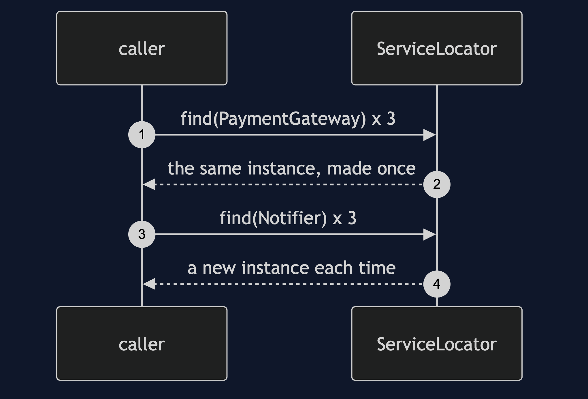
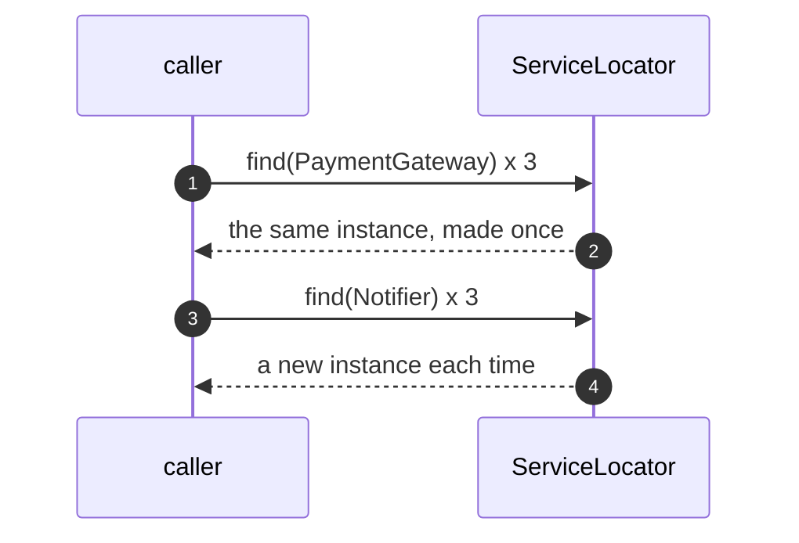
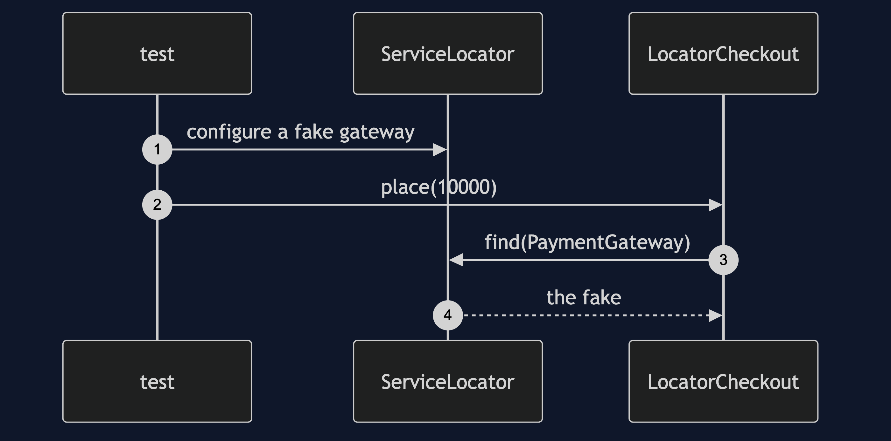
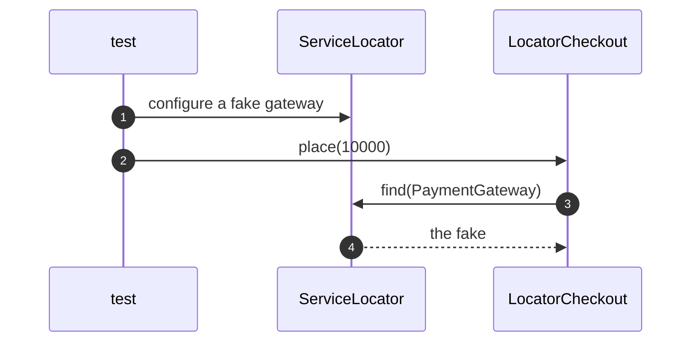
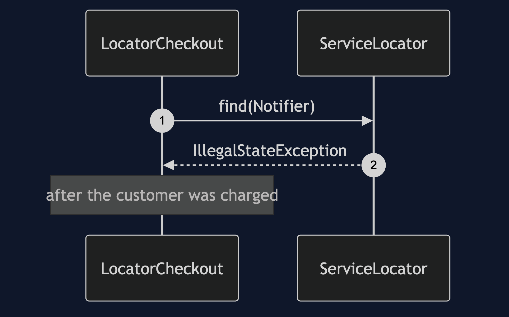
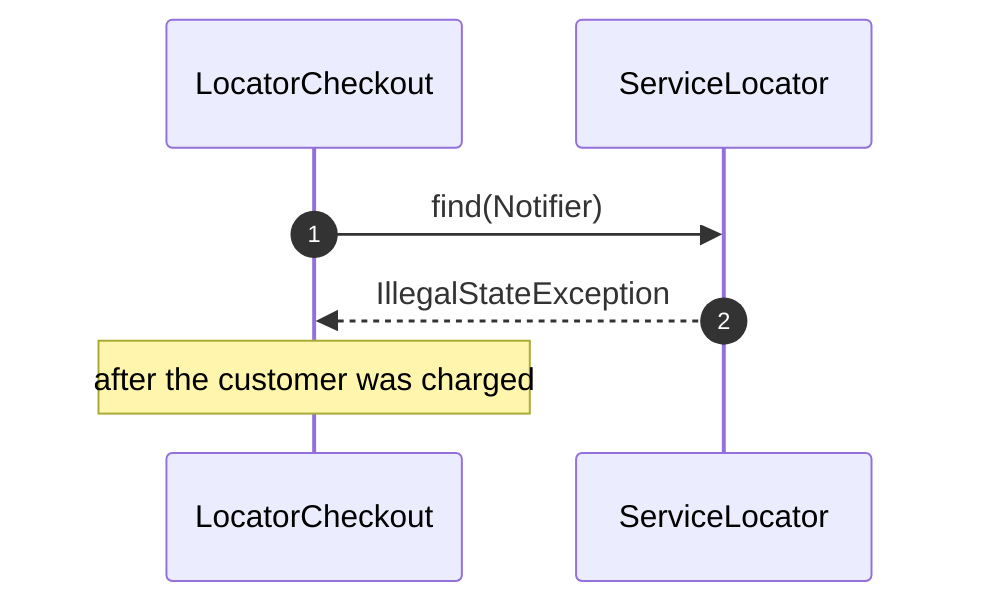
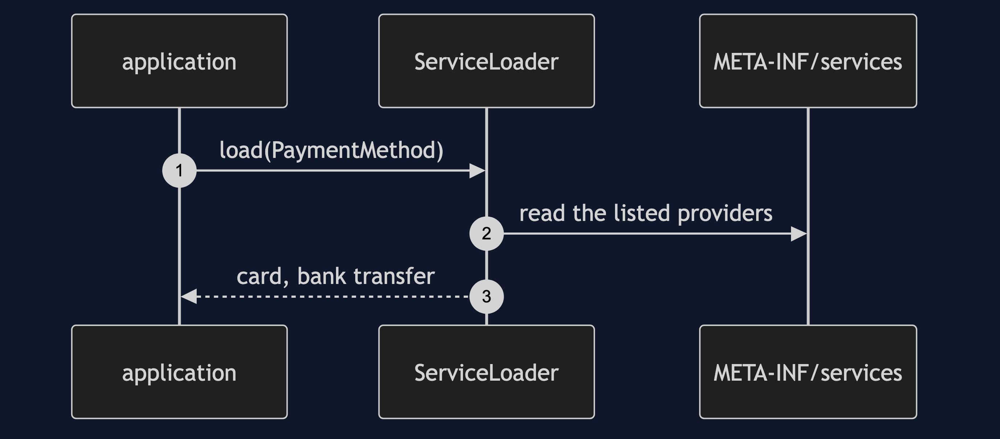
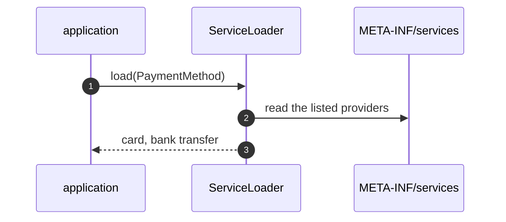

# Service Locator Pattern — UML Sequence Diagrams

Four sequences.

## 1. Lifetimes

Mermaid source

## 2. Swapped For A Test

Mermaid source

## 3. A Missing Registration

Mermaid source

## 4. ServiceLoader

Mermaid source

