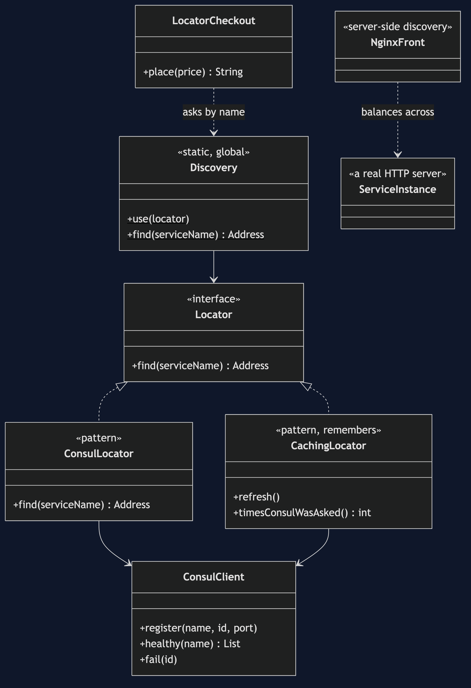
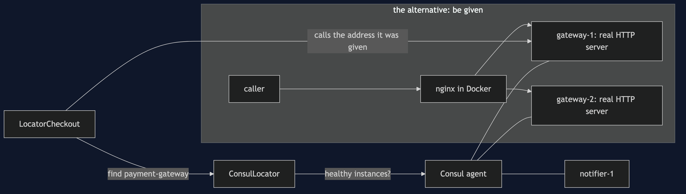
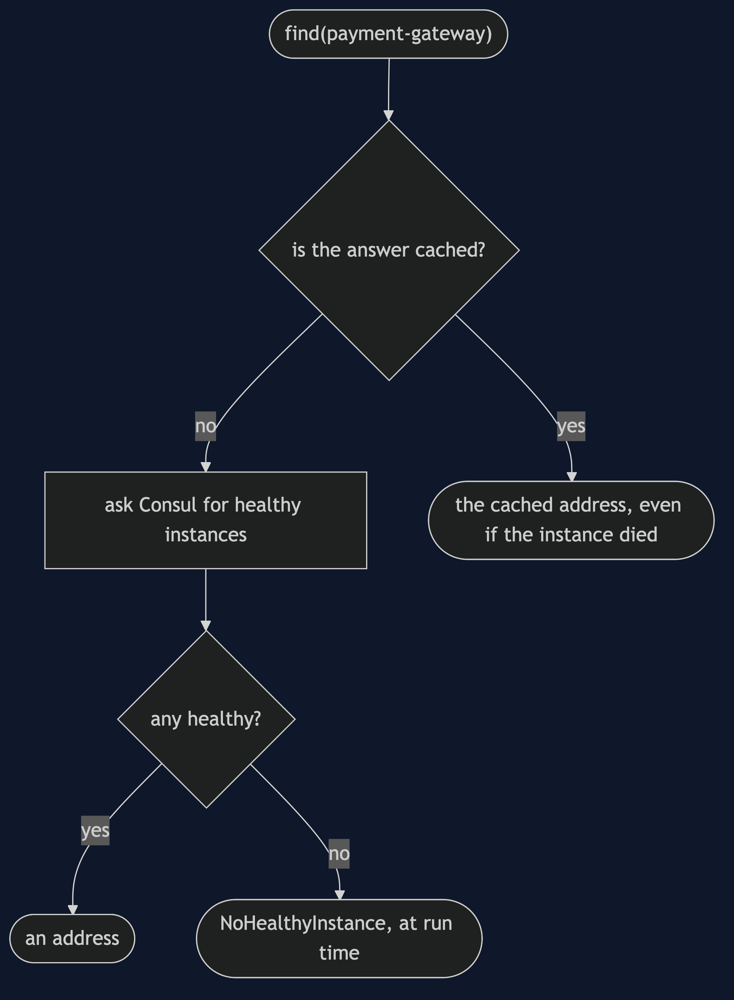
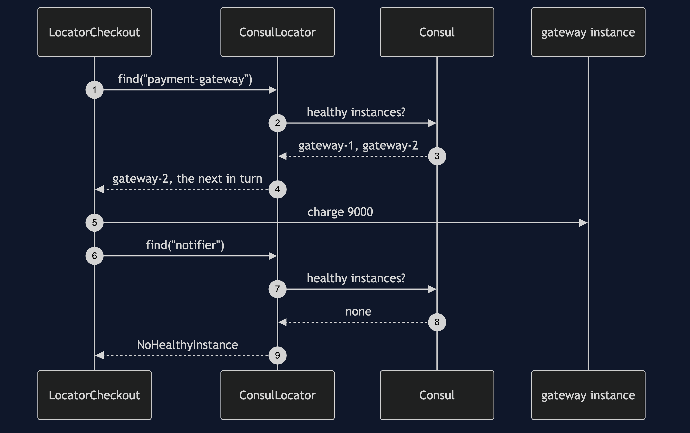
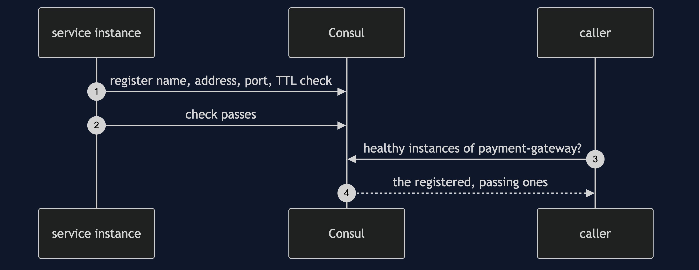
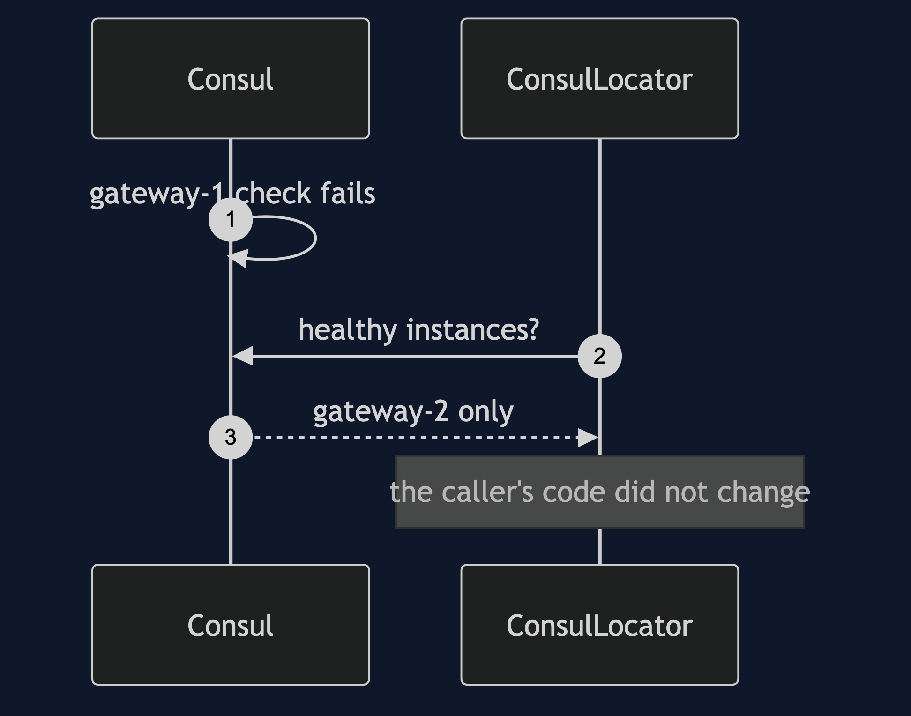
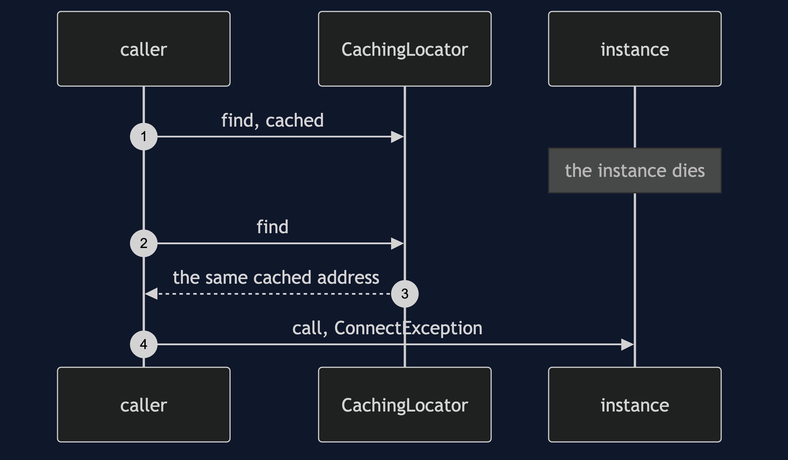
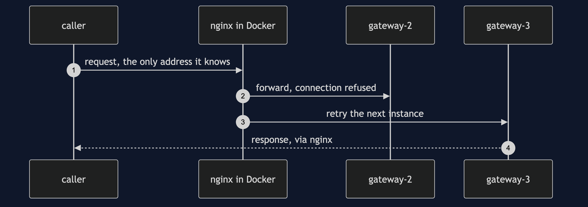

# Service Locator with Consul Pattern

```
src/main/java/com/jk/explore/locatorconsul/
├── ConsulDemo.java                  composition root — the six acts
│
├── consul/
│   ├── ConsulAgent.java              a real Consul agent, as a local process, on free ports
│   ├── ConsulClient.java             Consul's HTTP API, called directly: register, check, healthy
│   └── Address.java
├── gateway/
│   └── ServiceInstance.java          a real HTTP server standing for one running instance
├── pattern/                         ← the real thing
│   ├── Locator.java                  ask by name, get an address
│   ├── ConsulLocator.java            asks Consul for the healthy instances, and rotates
│   ├── CachingLocator.java           the same, remembering: faster, and it goes stale
│   ├── Discovery.java                the static way in: every class depends on it
│   ├── LocatorCheckout.java          asks for "payment-gateway" and "notifier" by name
│   └── NoHealthyInstance.java        found at run time
└── nginx/
    └── NginxFront.java               server-side discovery: nginx in Docker, in front of the instances
```

**Service discovery is a service locator over a network: ask Consul for the healthy instances of a service by name. It is the strongest case for the pattern, and it still has the pattern's costs.**

This project is the framework version of [Service Locator](../service-locator-pattern). That project argued against the pattern, and said it is still right for plug-in systems, where what is available is a run-time fact. Service discovery is the same case over a network. This one runs a real Consul agent, real HTTP instances, and an nginx container, and shows the advance, the same costs, a new one (a stale cache), and the alternative: be given an address instead of asking.

## Run

```bash
./gradlew run
```

Six acts, against a real Consul agent, real HTTP service instances, and, where Docker is available, a real nginx container. Ports are chosen at run time and never printed, so the output is the same every run. The demo needs `consul` on the PATH; act five needs Docker and the `nginx:1.31.5-alpine` image.

```
SERVICE LOCATOR WITH CONSUL — real service discovery

ONE. The locator asks Consul, and Consul answers with what is really running.
  registered: two payment-gateway instances and one notifier, each a real HTTP server, each with a health check.
  healthy payment-gateway instances Consul reports: 2
  four orders placed. served by gateway-1: 2, by gateway-2: 2.
  LocatorCheckout never knew an address. it asked for "payment-gateway" by name.

TWO. The genuine advance: instances change and the caller's code does not.
  gateway-1's health check is marked failing. healthy instances now: 1
  four more orders. gateway-1 served 0, gateway-2 served 4.
  gateway-1 recovers and is used again: healthy instances 2.
  no change to LocatorCheckout. this is what a registry with static entries could never do.

THREE. The bill: the names are strings, and the compiler says nothing.
  a typo, "payment-gatway", compiled. at run time: no healthy instance of "payment-gatway"
  the notifier's registration is lost, and nothing about LocatorCheckout says it needs one.
  then, on a real order: no healthy instance of "notifier"
  and the payment gateway had already been called: 1 charge went through.
  the failure arrived in production, after the money moved. the same bill as the hand-built locator.

FOUR. The bill: a cached answer goes stale.
  a caching locator asked Consul once, and remembers the answer.
  gateway-1 dies, and Consul is told. the cache is not.
  the cached address is still handed out, and the call fails: could not reach the dead instance: ConnectException
  Consul was asked 1 time in total. faster, and wrong.
  the uncached locator recovers at once: handled by gateway-2
  after a refresh the cache heals too. deciding when to refresh is now your problem.

FIVE. The alternative: do not ask. be given.
  nginx, in a Docker container, was given the healthy instances once, from Consul.
  the caller was given one address, nginx's, and asked nothing. 4 of 4 requests succeeded.
  it spread them across the two instances: gateway-2 served 2, gateway-3 served 2.
  gateway-2 is stopped. 4 of 4 more requests still succeed: all 4 were served by gateway-3, because nginx retried the next instance.
  the class never knew, because it never looked anything up.

SIX. The verdict.
  service discovery is the strongest case for a locator: where instances are is a run-time fact.
  even so, prefer to be given an address by the platform, a proxy or DNS, than to have every class ask.
  where you have met this: Spring Cloud's DiscoveryClient, Consul, Eureka, and Kubernetes DNS.
```

## Test

```bash
./gradlew test
```

3 test classes, 8 test methods, offline, against a real Consul agent (skipped, not failed, when `consul` is not installed) and a real nginx container (skipped when Docker or the image is unavailable).

## Technologies and versions

| What | Version | Why it is here |
| --- | --- | --- |
| Java | 21 | The repository standard, via the Gradle toolchain block |
| Gradle | 9.2.1 | The wrapper in this directory; no separate install needed |
| Consul | 1.16 or newer, on the PATH | The real service-discovery agent, run in development mode as a local process |
| Docker | any recent version | Runs nginx for act five. Optional: without it, that act is skipped |
| nginx | `nginx:1.31.5-alpine` image | Server-side discovery: the caller is given one address |
| JUnit 5 | 5.10.2 | Test runner |

No Java library beyond the JDK: Consul is called over its HTTP API and the instances are `com.sun.net.httpserver` servers. See [`docs/dependencies.md`](docs/dependencies.md).

## Learning Material

| Document | What it covers |
| --- | --- |
| [`docs/problem-statement.md`](docs/problem-statement.md) | The partner's checkout, across a network |
| [`docs/service-locator-with-consul-pattern-explained.md`](docs/service-locator-with-consul-pattern-explained.md) | The advance, the old costs, a new one, and being given an address |
| [`docs/class-diagram.md`](docs/class-diagram.md) | The types |
| [`docs/architecture-diagram.md`](docs/architecture-diagram.md) | The checkout, Consul, and the instances |
| [`docs/data-flow-diagram.md`](docs/data-flow-diagram.md) | One lookup: an address, a stale one, or nothing |
| [`docs/sequence-diagram.md`](docs/sequence-diagram.md) | Written for a listener with the screen off |
| [`docs/uml-diagram.md`](docs/uml-diagram.md) | Four sequences |
| [`docs/animation.html`](docs/animation.html) | The six acts in a browser |
| [`docs/prerequisites.md`](docs/prerequisites.md) | What you need to know |
| [`docs/session.md`](docs/session.md) | A one-hour taught session |
| [`docs/spec.md`](docs/spec.md) | The generated specification |
| [`docs/youtube.md`](docs/youtube.md) | Title, description and chapters |
| [`docs/dependencies.md`](docs/dependencies.md) | What Consul, Docker and nginx are, what they cost, and that skipping this project loses none of the pattern |

### The pattern in one picture



### Where each piece sits



### How one request moves



### Who calls whom, in order



### All four sequences









### Video

Built from [`video/scenes.py`](video/scenes.py) by
[`video/build_video.sh`](video/build_video.sh). The rendered file is not
committed; see the repository README for why.

## Where you have already met this

Spring Cloud's `DiscoveryClient`, Netflix Eureka and Consul itself. Kubernetes DNS is the given form.

## When this is too much

For a fixed set of services with fixed addresses, configuration is simpler and needs no registry at all.

## Where this sits

This project pairs with [Service Locator](../service-locator-pattern), and is a framework version in [`foundational-design-patterns`](..). Its alternative is [Dependency Injection](../dependency-injection-pattern)'s idea, applied to a network address.
