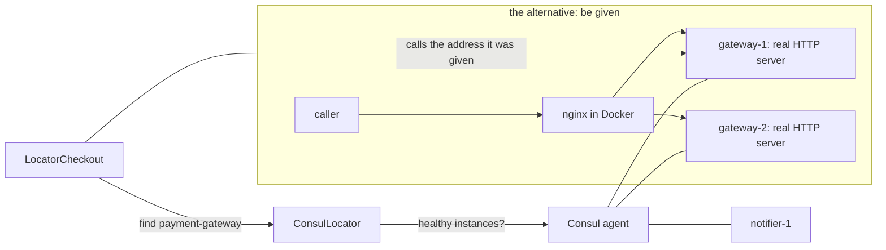

# Service Locator with Consul Pattern — Architecture Diagram

The checkout asks by name. Consul knows what is really running.

Mermaid source

```mermaid
flowchart LR
    C["LocatorCheckout"] -->|find payment-gateway| L["ConsulLocator"]
    L -->|healthy instances?| K["Consul agent"]
    K --- G1["gateway-1: real HTTP server"]
    K --- G2["gateway-2: real HTTP server"]
    K --- N["notifier-1"]
    C -->|calls the address it was given| G1
    subgraph Alt["the alternative: be given"]
        X["caller"] --> NG["nginx in Docker"] --> G1
        NG --> G2
    end
```

