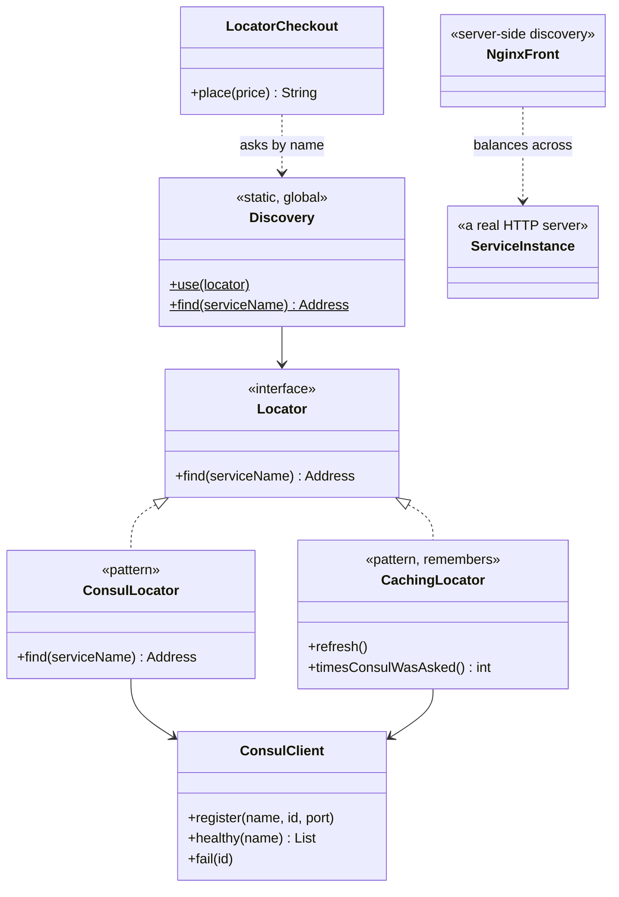

# Service Locator with Consul Pattern — Class Diagram

Every class that needs a remote service calls `Discovery`, which asks a `Locator`.

Mermaid source

```mermaid
classDiagram
    class Locator {
        <<interface>>
        +find(serviceName) Address
    }
    class ConsulLocator {
        <<pattern>>
        +find(serviceName) Address
    }
    class CachingLocator {
        <<pattern, remembers>>
        +refresh()
        +timesConsulWasAsked() int
    }
    class Discovery {
        <<static, global>>
        +use(locator)$
        +find(serviceName)$ Address
    }
    class LocatorCheckout {
        +place(price) String
    }
    class ConsulClient {
        +register(name, id, port)
        +healthy(name) List
        +fail(id)
    }
    class ServiceInstance {
        <<a real HTTP server>>
    }
    class NginxFront {
        <<server-side discovery>>
    }
    Locator <|.. ConsulLocator
    Locator <|.. CachingLocator
    ConsulLocator --> ConsulClient
    CachingLocator --> ConsulClient
    LocatorCheckout ..> Discovery : asks by name
    Discovery --> Locator
    NginxFront ..> ServiceInstance : balances across
```

