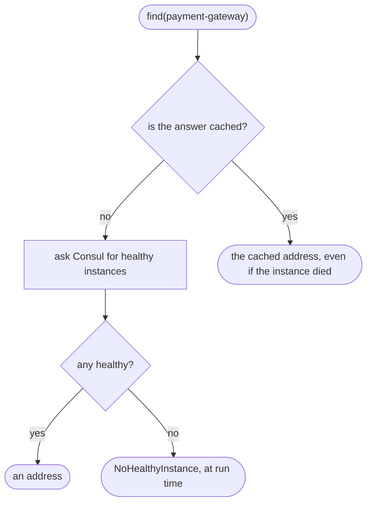

# Service Locator with Consul Pattern — Data Flow Diagram

One lookup: an address, a stale address, or nothing.

Mermaid source

```mermaid
flowchart TD
    Ask(["find(payment-gateway)"])
    Cached{"is the answer cached?"}
    Consul["ask Consul for healthy instances"]
    Any{"any healthy?"}
    Addr(["an address"])
    None(["NoHealthyInstance, at run time"])
    Stale(["the cached address, even if the instance died"])
    Ask --> Cached
    Cached -- yes --> Stale
    Cached -- no --> Consul --> Any
    Any -- yes --> Addr
    Any -- no --> None
```

