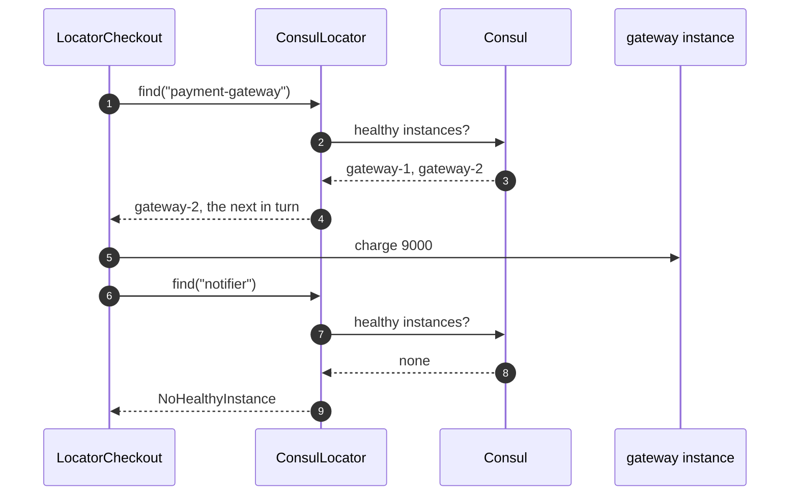

# Service Locator with Consul Pattern — Sequence Diagram

Written for a listener with the screen off.

Say it in words. The checkout wants to charge a customer. It asks the locator for a payment gateway, by name. The locator asks Consul for the instances whose health checks are passing, and Consul names two. The locator hands back the next one in turn, and the checkout calls it over HTTP. Then the checkout asks for the notifier, and Consul knows of none healthy. The locator throws, and the customer has already been charged.

Mermaid source

The load-bearing sentence: **the failure arrived after the money moved, not in the build.**
