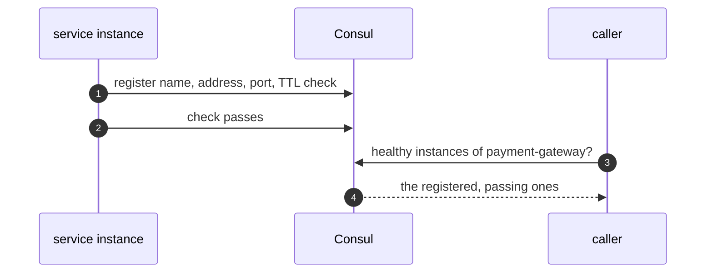
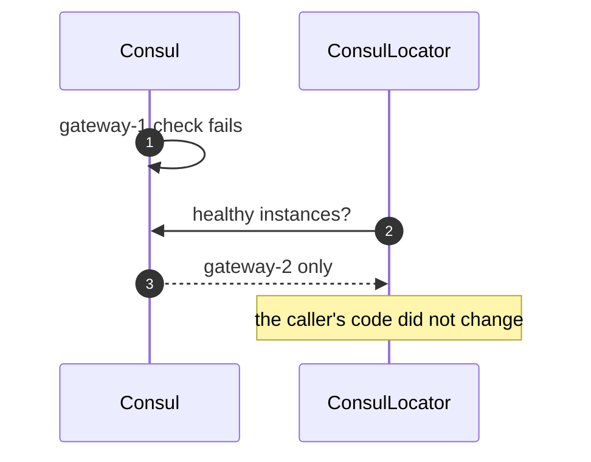
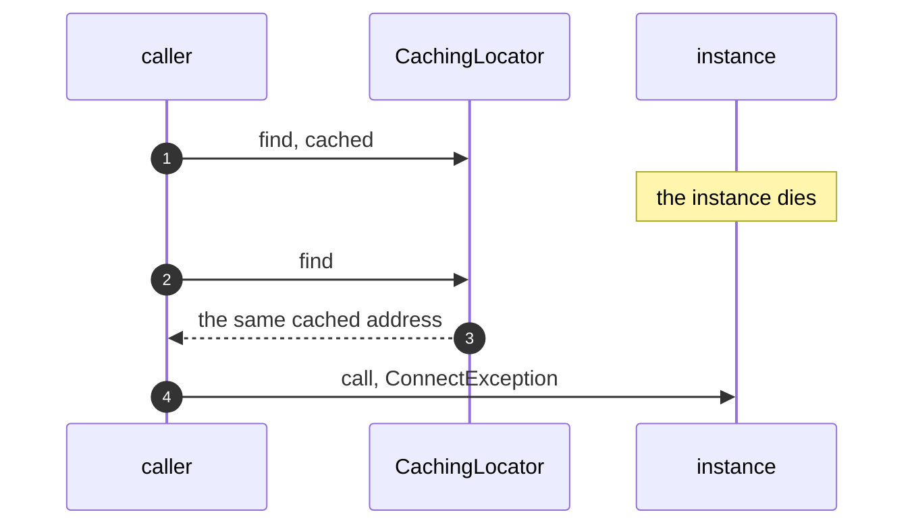
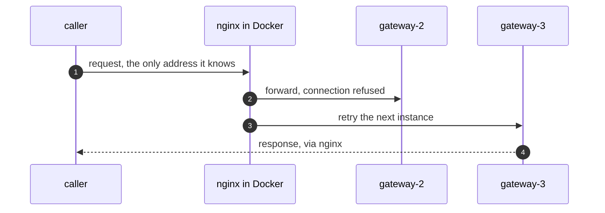

# Service Locator with Consul Pattern — UML Sequence Diagrams

Four sequences.

## 1. Register And Discover

Mermaid source

## 2. An Instance Fails Its Check

Mermaid source

## 3. A Stale Cache

Mermaid source

## 4. Server-Side Discovery

Mermaid source

