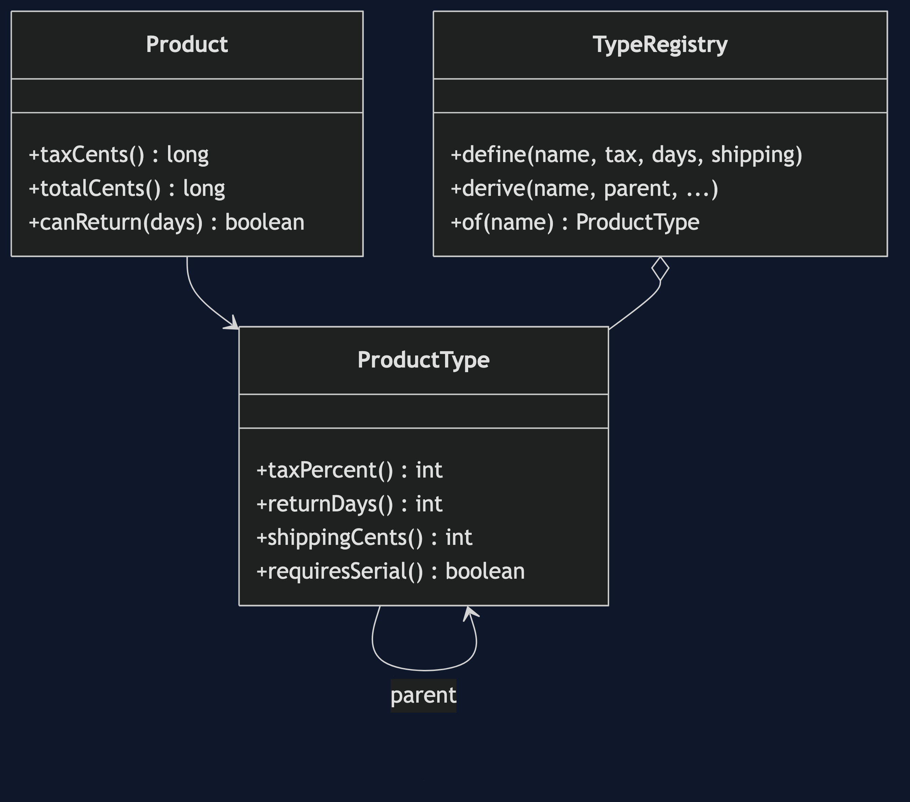
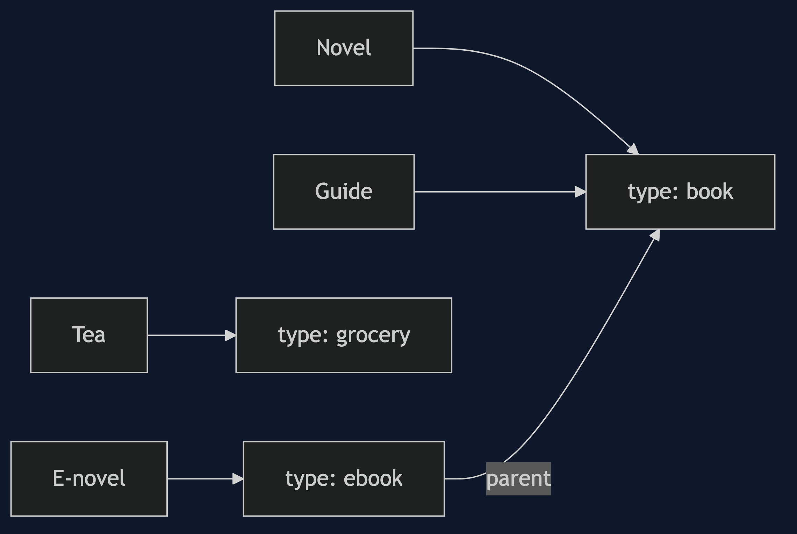

# Type Object Pattern

```
src/main/java/com/jk/explore/typeobject/
├── TypeObjectDemo.java              the six acts
├── ProductType.java                 tax, return days, shipping; inherits from a parent
├── TypeRegistry.java                types by name; made at run time
├── Product.java                     one class for every product
│
└── naive/
    ├── KindProduct.java             the base of the subclass version
    ├── Book.java
    ├── Laptop.java
    └── Grocery.java
```

**Type object: make the kind of a thing into data, so a new kind is a new object, not a new class.**

This project is in [foundational-design-patterns](..). It is [Flyweight](../../structural/flyweight-pattern) turned around: the shared part is the kind, and it is meant to be changed, and it is the simple side of [Strategy](../../behavioural/strategy-pattern), where the type holds data and not steps.

## Run

```bash
./gradlew run
```

Six acts. Every number quoted below comes from this program's own output.

```
ONE. A class for each kind.
  3 kinds, 3 classes, and they differ only in three numbers. a novel: 1300.
  a gift card is a fourth kind. that is a fourth class, a new build and a release.
TWO. A type that is data.
  one Product class. novel 1300, laptop 96000, tea 620.
  laptops can be returned after 10 days: true. after 20 days: false.
THREE. A new kind at run time.
  types before 3, after 4. classes added: 0. a 25 pound card totals 2500, and can be returned after 1 day: false.
FOUR. Change the type, change every product.
  tax on tea 20, on coffee 40.
  grocery tax raised to 10 percent, in one place. tea 40, coffee 80.
FIVE. A type that inherits.
  ebook states only its shipping: 0. tax 0 and return days 30 come from book.
SIX. The bill.
  a typo, "bok": no type named bok, found when it runs. with a class for each kind, the typo would not compile.
  laptops need a serial number checked, and a type holds data, not steps. the flag says so: requiresSerial true. the code that checks it is still somewhere else.
  every new difference between kinds is a new field, and every field is a thing the code must remember to read. the type has 6 fields already.
```

## Test

```bash
./gradlew test
```

2 test classes, 8 test methods, offline, with nothing installed and no framework.

## Technologies and versions

| What | Version | Why it is here |
| --- | --- | --- |
| Java | 21 | The repository standard, via the Gradle toolchain block |
| Gradle | 9.2.1 | The wrapper in this directory; no separate install needed |
| JUnit 5 | 5.10.2 | Test runner |

No framework. A hand-built project stays plain Java so the mechanism is the whole lesson.

## Learning Material

| Document | What it covers |
| --- | --- |
| [`docs/problem-statement.md`](docs/problem-statement.md) | The scenario, and the problem |
| [`docs/type-object-pattern-explained.md`](docs/type-object-pattern-explained.md) | The pattern, and six acts |
| [`docs/class-diagram.md`](docs/class-diagram.md) | The types |
| [`docs/architecture-diagram.md`](docs/architecture-diagram.md) | The parts and how they connect |
| [`docs/data-flow-diagram.md`](docs/data-flow-diagram.md) | What happens to one request |
| [`docs/sequence-diagram.md`](docs/sequence-diagram.md) | Written for a listener with the screen off |
| [`docs/uml-diagram.md`](docs/uml-diagram.md) | Four sequences |
| [`docs/animation.html`](docs/animation.html) | The six acts in a browser |
| [`docs/prerequisites.md`](docs/prerequisites.md) | What you need to know |
| [`docs/session.md`](docs/session.md) | A one-hour taught session |
| [`docs/spec.md`](docs/spec.md) | The generated specification |
| [`docs/youtube.md`](docs/youtube.md) | Title, description and chapters |

### The pattern in one picture



### Where each piece sits



### How one request moves


### Who calls whom, in order


### All four sequences


### Video

Built from [`video/scenes.py`](video/scenes.py) by
[`video/build_video.sh`](video/build_video.sh). The rendered file is not
committed; see the repository README for why.

## Where you have already met this

Game engines and their monster types, product catalogues, and the ways a database row points at its type.

## When this is too much

If the kinds are few, fixed, and differ in behaviour, plain subclasses are clearer. A type object pays off when kinds are many, or added by non-programmers.

## Where this sits

This project is in [`foundational-design-patterns`](..), and is meant to be read with its neighbours there.
