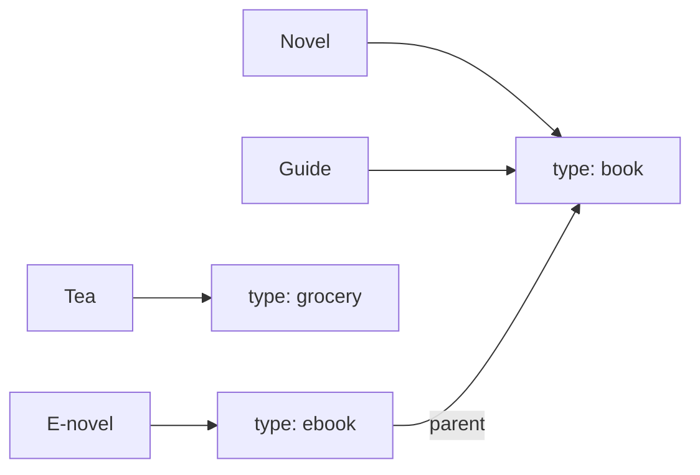

# Type Object Pattern — Architecture Diagram

Products share types. Types can share a parent.

Mermaid source

```mermaid
flowchart LR
    P1["Novel"] --> B["type: book"]
    P2["Guide"] --> B
    P3["Tea"] --> G["type: grocery"]
    E["type: ebook"] -->|parent| B
    P4["E-novel"] --> E
```

