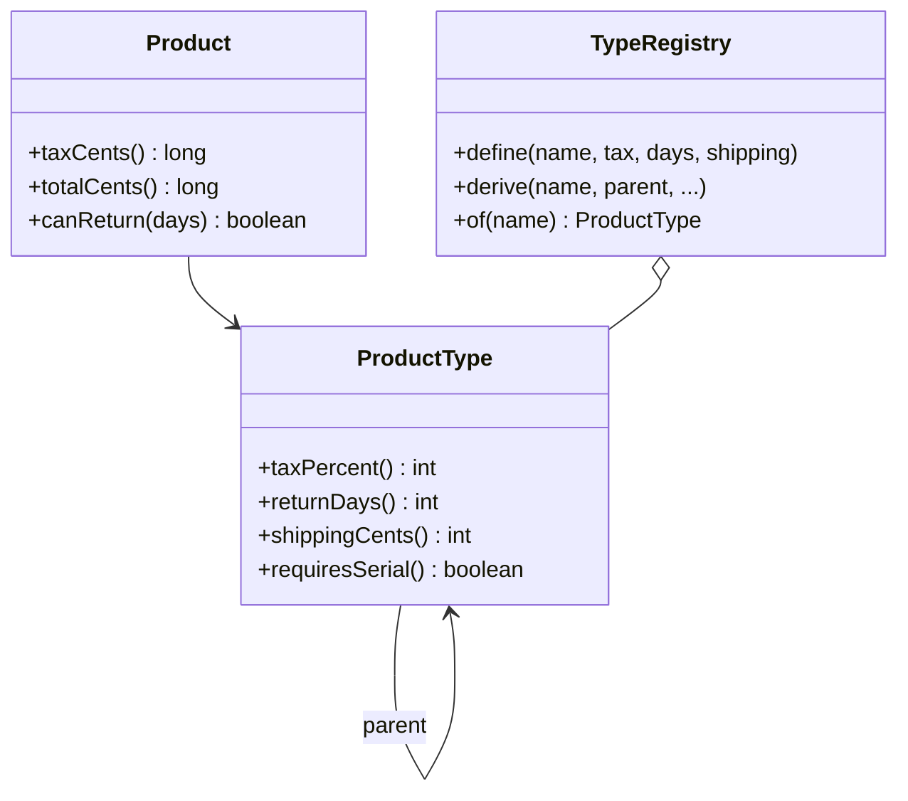

# Type Object Pattern — Class Diagram

One product class, pointing at a type that can inherit from another.

Mermaid source

```mermaid
classDiagram
    class Product {
        +taxCents() long
        +totalCents() long
        +canReturn(days) boolean
    }
    class ProductType {
        +taxPercent() int
        +returnDays() int
        +shippingCents() int
        +requiresSerial() boolean
    }
    class TypeRegistry {
        +define(name, tax, days, shipping)
        +derive(name, parent, ...)
        +of(name) ProductType
    }
    Product --> ProductType
    ProductType --> ProductType : parent
    TypeRegistry o-- ProductType
```

