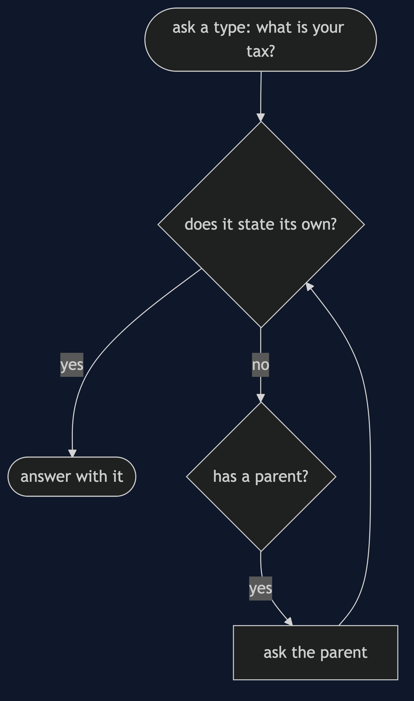
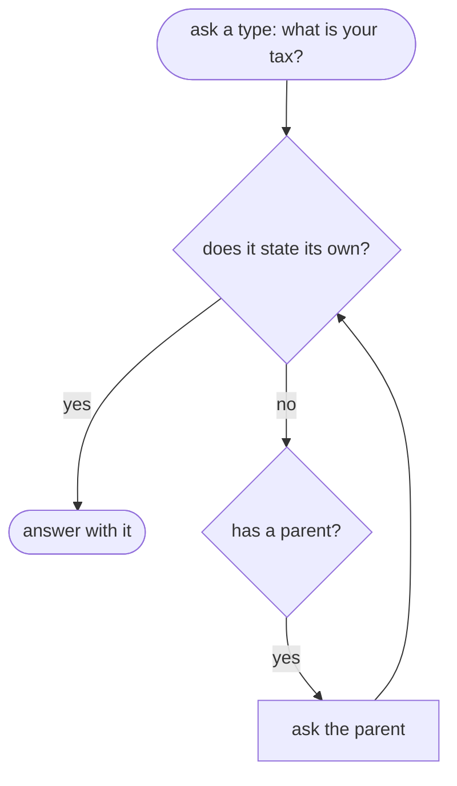

# Type Object Pattern — Data Flow Diagram

How a type answers a question about itself.

Mermaid source

```mermaid
flowchart TD
    Ask(["ask a type: what is your tax?"])
    Own{"does it state its own?"}
    Say(["answer with it"])
    Parent{"has a parent?"}
    Up["ask the parent"]
    Ask --> Own
    Own -- yes --> Say
    Own -- no --> Parent
    Parent -- yes --> Up --> Own
```

