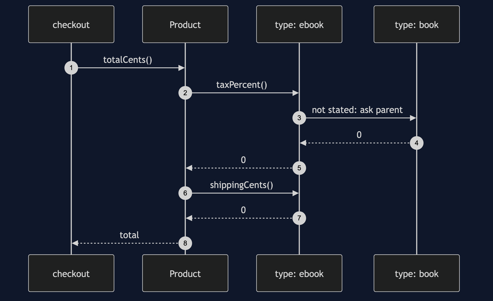
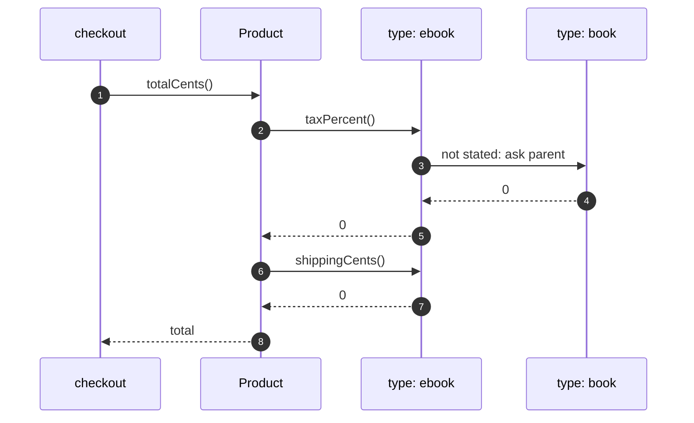

# Type Object Pattern — Sequence Diagram

Written for a listener with the screen off.

Say it in words. The checkout asks a product for its total. The product asks its type for the tax and the shipping. The type is an ebook. It states its own shipping, but not its tax, so it asks its parent, book, which answers zero. The product adds it up.

Mermaid source

The load-bearing sentence: **the type answers from itself, or from its parent.**
