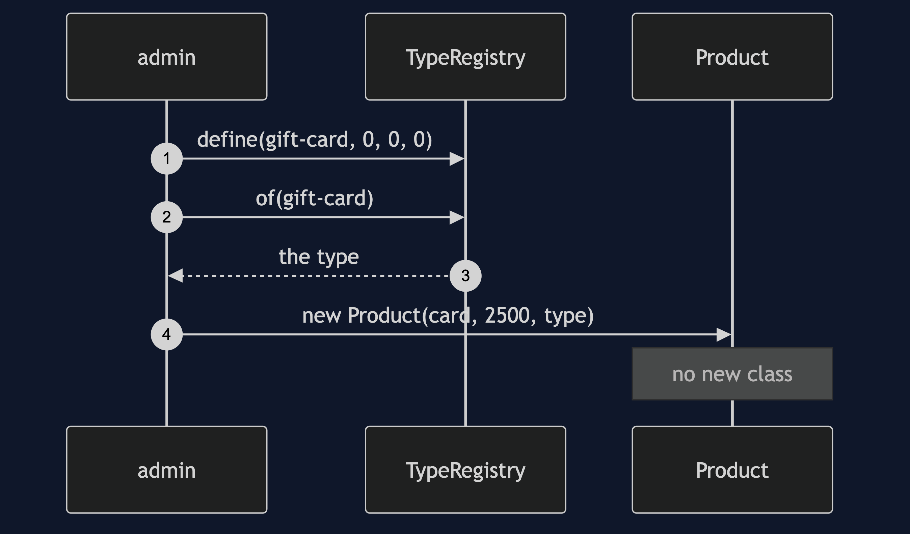
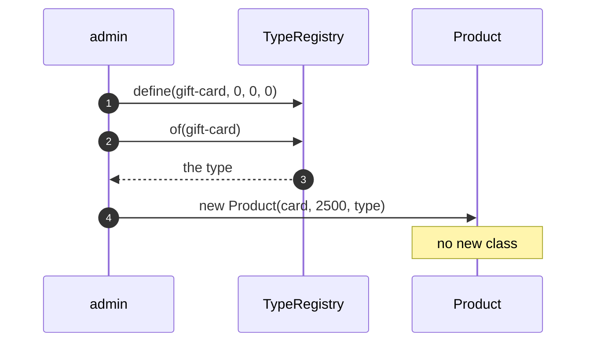

# Type Object Pattern — UML Sequence Diagrams

Four sequences.

## 1. A New Kind At Run Time

Mermaid source

```mermaid
sequenceDiagram
    autonumber
    participant A as admin
    participant R as TypeRegistry
    participant P as Product
    A->>R: define(gift-card, 0, 0, 0)
    A->>R: of(gift-card)
    R-->>A: the type
    A->>P: new Product(card, 2500, type)
    Note over P: no new class
```

