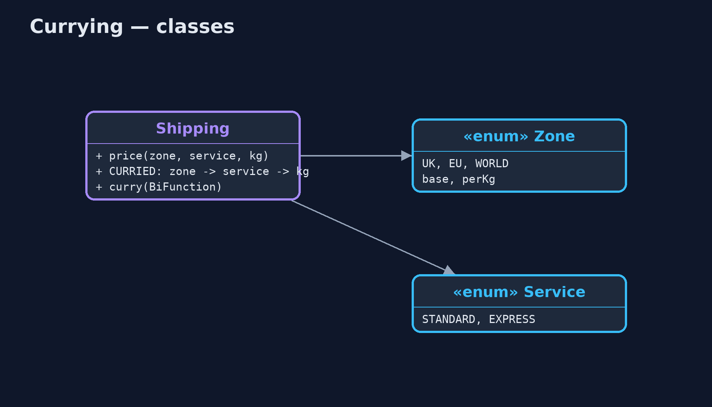

# Currying Pattern

```
src/main/java/com/jk/explore/currying/
├── CurryingDemo.java  The five acts: repeated arguments, a curried function, ready-made functions per zone, argument order, and the bill
├── Service.java       How fast: express costs twice as much
├── Shipping.java      The shipping price, first as an ordinary three-argument method, then curried: a chain of one-argument functions, so the first arguments can be fixed early
└── Zone.java          Where a parcel is going, with the carrier's base charge and charge per kilogram
```

**Turn a function of several arguments into a chain of one-argument functions, so the arguments known early can be fixed once, leaving a smaller function for the ones that change.**

Currying turns a function that takes several arguments into a chain of
functions that each take one. Instead of `price(zone, service, weight)`, you
have a function that takes a zone and returns a function that takes a
service, which returns a function that takes a weight.

The point is partial application: supplying some arguments now and the rest
later. A warehouse that always ships to the EU by standard post fixes those
two once, and is left with a simple function of weight alone. The name comes
from the logician Haskell Curry.

## The idea in everyday terms

Think of a coffee shop loyalty card that already knows your usual: oat milk,
large. At the counter you only say "latte" or "flat white". The usual choices
were fixed once, when the card was set up; only the part that changes is given
each time.

## The scenario

The online store's shipping price depends on the zone, the service and the
weight. The EU warehouse only ever ships to the EU by standard post, yet
every call it made spelled out "EU, STANDARD" before the one argument that
actually changed: the weight.

## Run

```bash
./gradlew run
```

The demo tells the story in 5 acts, each printing exact numbers that the tests check:

| Act | What it shows |
| --- | --- |
| 1. Repeated arguments | The EU warehouse calls price(EU, STANDARD, kg) for 0.5, 2 and 10 kg: 7.00, 10.00, 26.00, repeating EU and STANDARD every time. |
| 2. A curried function | euStandard = CURRIED.apply(EU).apply(STANDARD); euStandard.apply(2.0) is 10.00, the same as price(EU, STANDARD, 2.0). |
| 3. Ready-made functions | One function per zone is built at start-up: 2 kg standard is UK 5.00, EU 10.00, WORLD 20.00; EU express mapped over parcels gives 14, 20, 52. |
| 4. Argument order matters | discount(percent, price) curried and given 20 is a 20%-off function: 45 becomes 36.00; with (price, percent), 20 fixes the price and gives 11.00. |
| 5. The bill | The type is Function<Zone, Function<Service, Function<Double, Double>>>; a plain lambda kg -> price(EU, STANDARD, kg) gives the same 10.00. |

## Test

```bash
./gradlew test
```

3 tests in `DemoRunsTest`, `ShippingTest`. Every number the demo prints is asserted, and nothing depends on the clock, so every run gives the same result.

## Technologies and versions

| Technology | Version | Used for |
| --- | --- | --- |
| Java | 21 | the code (toolchain set in `build.gradle`) |
| Gradle | 9.2.1 (wrapper) | build and run, nothing to install |
| JUnit | 5.10.2 | the tests |
| videokit | repository tool | the narrated video and animation: Piper `en_US-amy-medium`, speed 0.8, longer pauses (the approved `amy-slow` voice) |

## Learning Material

| Document | What it is for |
| --- | --- |
| [Problem statement](docs/problem-statement.md) | the situation and what the project must show |
| [Prerequisites](docs/prerequisites.md) | what you need to know first |
| [Currying, explained](docs/currying-pattern-explained.md) | the acts in prose |
| [Session guide](docs/session.md) | a one-hour lesson with exercises |
| [Animated walkthrough](docs/animation.html) | the acts step by step, narrated |
| [Spec](docs/spec.md) | what this project must be true of |

### The pattern in one picture

Each step returns a smaller function.


### Where each piece sits

The same price, two shapes.



### How the data moves

One function per zone; checkout gives only the weight.


### Who calls whom, in order

Two applies now, one later.


### Video

`video/currying-pattern-explained.mp4` (with `.m4a` audio and `.srt` subtitles) is built by `video/build_video.sh`. Rendered media is not committed.

## What it costs

- **Noisy in Java.** The type `Function<Zone, Function<Service, Function<Double, Double>>>` and chains of `.apply` are hard to read.
- **Order is fixed.** Currying fixes arguments first to last, so they must be ordered from least to most changing; the wrong order gave nonsense.
- **Often a lambda is clearer.** `kg -> price(EU, STANDARD, kg)` does the same partial application in plain sight.

## When this is too much

When a function is always called with all its arguments, currying adds only
noise. It pays off when some arguments are known long before others, and the
smaller function is passed around or reused.

## Where you have already met this

- Every function in Haskell and F# is curried.
- `Function<A, Function<B, R>>` in Java libraries such as Vavr, with `curried()`.
- Configured objects and factories: fixing settings once, then calling with the changing part.

## Where this sits

This project is in [functional-design-patterns](..), next to
[Higher-Order Functions](../higher-order-functions-pattern): a curried function
is a function that returns a function.
