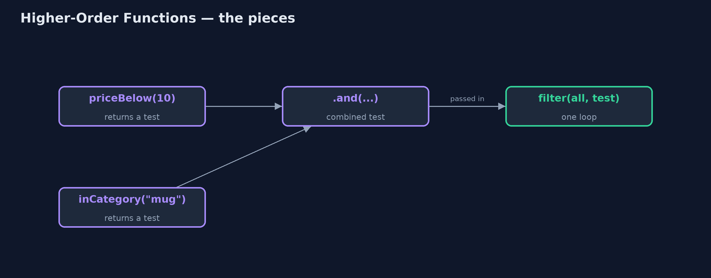

# Higher-Order Functions Pattern

```
src/main/java/com/jk/explore/higherorder/
├── Catalogue.java         The pattern: functions that take functions, and functions that return them
├── CopyPasteFilters.java  Before: one loop per question
├── HigherOrderDemo.java   The five acts: a loop per question, passing the test in, making tests to order, price rules as values, and the bill
└── Product.java           A product in the store's catalogue
```

**Write functions that take other functions, or return them, so one piece of code can serve many questions and small rules can be combined into bigger ones.**

A higher-order function is a function that takes another function as an
argument, or returns one as its result. In Java, the functions are lambdas or
method references, typed as interfaces such as `Predicate` and `Function`.

Taking a function lets one method do many jobs: one `filter` loop, with the
test passed in, replaces a separate loop for every question. Returning a
function lets you make rules to order, like `priceBelow(10)`, and combine
them with `and`, `or` and `andThen`. Java's streams are built entirely on this
idea.

## The idea in everyday terms

Think of a coffee machine that takes pods. The machine does the hard part,
heat and pressure, once. The pod decides the drink. You do not buy a new
machine for each flavour; you pass a different pod in. And a pod can be made
to order: a strength and a flavour, combined.

## The scenario

The online store's catalogue page answers questions such as "under 10",
"in stock" and "mugs". Each question had its own method with its own loop,
identical except for the one test in the middle. Every new question, such as
"mugs under 10 that are in stock", meant copying the loop again.

## Run

```bash
./gradlew run
```

The demo tells the story in 5 acts, each printing exact numbers that the tests check:

| Act | What it shows |
| --- | --- |
| 1. A loop for every question | under10, inStock and mugs are 3 methods with 3 identical loops; a combined question would need a 4th. |
| 2. Pass the test in | One filter method takes the test as a function: filter(all, p -> p.price() < 10) gives the same answer as the copied loop. |
| 3. Functions that make functions | priceBelow(10).and(inCategory("mug")).and(inStock()) finds the Blue mug; priceBelow(20).and(inStock().negate()) finds the Travel mug. |
| 4. Price rules as values | Desk lamp 45.00: 20% off then 5 off is 31.00; 5 off then 20% off is 32.00. |
| 5. The bill | Anonymous lambdas can hide rules and show generated names in stack traces; name the important functions and keep them short. |

## Test

```bash
./gradlew test
```

4 tests in `CatalogueTest`, `DemoRunsTest`. Every number the demo prints is asserted, and nothing depends on the clock, so every run gives the same result.

## Technologies and versions

| Technology | Version | Used for |
| --- | --- | --- |
| Java | 21 | the code (toolchain set in `build.gradle`) |
| Gradle | 9.2.1 (wrapper) | build and run, nothing to install |
| JUnit | 5.10.2 | the tests |
| videokit | repository tool | the narrated video and animation: Piper `en_US-amy-medium`, speed 0.8, longer pauses (the approved `amy-slow` voice) |

## Learning Material

| Document | What it is for |
| --- | --- |
| [Problem statement](docs/problem-statement.md) | the situation and what the project must show |
| [Prerequisites](docs/prerequisites.md) | what you need to know first |
| [Higher-Order Functions, explained](docs/higher-order-functions-pattern-explained.md) | the acts in prose |
| [Session guide](docs/session.md) | a one-hour lesson with exercises |
| [Animated walkthrough](docs/animation.html) | the acts step by step, narrated |
| [Spec](docs/spec.md) | what this project must be true of |

### The pattern in one picture

The loop is written once; the test is passed in.



### Where each piece sits

Functions in, functions out.


### How the data moves

Composed rules run left to right.


### Who calls whom, in order

The loop calls the test it was given.


### Video

`video/higher-order-functions-pattern-explained.mp4` (with `.m4a` audio and `.srt` subtitles) is built by `video/build_video.sh`. Rendered media is not committed.

## What it costs

- **Names matter more.** A long chain of anonymous lambdas can hide the rule it implements; name the important ones, like `priceBelow`.
- **Harder stack traces.** An error inside a lambda shows a generated name, not a method you wrote.
- **Order is meaning.** Joined rules run in order, and 20% off then 5 off is not the same as 5 off then 20% off.

## When this is too much

One loop with one test needs no function passed in. Higher-order functions
pay off when the same shape of code is repeated with only a small piece
changing.

## Where you have already met this

- `stream().filter(...)`, `map(...)` and `sorted(Comparator.comparing(...))`.
- `Predicate.and`, `Function.andThen` and `Comparator.thenComparing`.
- Callbacks and event listeners, which pass a function to be called later.

## Where this sits

This project is in [functional-design-patterns](..), next to
[Railway-Oriented Programming](../railway-oriented-pattern), whose `flatMap`
is itself a higher-order function.
