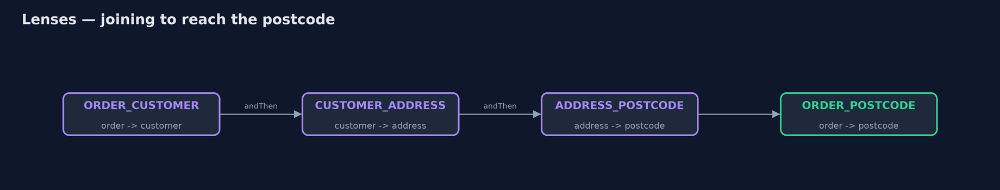

# Lenses for Immutable Updates Pattern

```
src/main/java/com/jk/explore/lenses/
├── Address.java     A delivery address
├── Customer.java    The customer who placed the order, and where to deliver
├── Lens.java        The pattern: a pair of functions that focus on one part of an immutable whole
├── Lenses.java      One small lens per field, written once
├── LensesDemo.java  The five acts: rebuilding by hand, one lens, joined lenses, changing with a function, and the bill
└── Order.java       An order: three levels deep, all immutable
```

**Pair a getter and a setter for one part of an immutable object into a lens, then join lenses to read or replace a part deep inside, getting a new whole and leaving the old one untouched.**

Immutable objects, such as Java records, cannot be changed once made. That
makes them safe to share, but changing one field deep inside is clumsy: to
change the postcode of an order's customer's address, you must build a new
address, a new customer around it, and a new order around that, copying every
other field by hand.

A lens is a pair of functions that focus on one part of a whole: `get` reads
the part, and `set` returns a new whole with that part replaced. Lenses join:
a lens from order to customer, then customer to address, then address to
postcode, becomes one lens from order to postcode. Changing the postcode is
then one line, and the old order is left exactly as it was.

## The idea in everyday terms

Think of a set of Russian nesting dolls, glued shut, where you want to change
the smallest doll. You cannot reach in; you must make new outer dolls around
a new inner one. A lens is a tool that knows how to do that for one doll,
and lenses can be joined, so one tool reaches all the way in.

## The scenario

The online store keeps orders as immutable records, three levels deep: an
order holds a customer, who holds a delivery address. When a customer
corrected a postcode, the code rebuilt all three by hand, and in one place a
developer passed the street and city in the wrong order. Both are strings, so
nothing complained, and a parcel was addressed to "Leeds, 1 High Street".

## Run

```bash
./gradlew run
```

The demo tells the story in 5 acts, each printing exact numbers that the tests check:

| Act | What it shows |
| --- | --- |
| 1. Rebuilding by hand | Changing one postcode takes 3 constructors; street and city, both strings, were swapped by mistake and nothing complained. |
| 2. One lens | ADDRESS_POSTCODE.get reads LS1 4AP; set returns a new address with LS2 7HY; the original is unchanged. |
| 3. Lenses join | ORDER_POSTCODE, joined from three lenses, sets the order's postcode in one line; the old order still says LS1 4AP. |
| 4. Change with a function | modify with toUpperCase turns ls2 7hy into LS2 7HY; city and postcode lenses together move the order to York, YO1 7HH. |
| 5. The bill | 4 field lenses written by hand for 3 levels; each set makes 3 new objects, but unchanged parts, like the order lines, are shared. |

## Test

```bash
./gradlew test
```

4 tests in `DemoRunsTest`, `LensLawsTest`. Every number the demo prints is asserted, and nothing depends on the clock, so every run gives the same result.

## Technologies and versions

| Technology | Version | Used for |
| --- | --- | --- |
| Java | 21 | the code (toolchain set in `build.gradle`) |
| Gradle | 9.2.1 (wrapper) | build and run, nothing to install |
| JUnit | 5.10.2 | the tests |
| videokit | repository tool | the narrated video and animation: Piper `en_US-amy-medium`, speed 0.8, longer pauses (the approved `amy-slow` voice) |

## Learning Material

| Document | What it is for |
| --- | --- |
| [Problem statement](docs/problem-statement.md) | the situation and what the project must show |
| [Prerequisites](docs/prerequisites.md) | what you need to know first |
| [Lenses for Immutable Updates, explained](docs/lenses-pattern-explained.md) | the acts in prose |
| [Session guide](docs/session.md) | a one-hour lesson with exercises |
| [Animated walkthrough](docs/animation.html) | the acts step by step, narrated |
| [Spec](docs/spec.md) | what this project must be true of |

### The pattern in one picture

Three lenses become one.



### Where each piece sits

A lens is two functions.


### How the data moves

New along the path; shared elsewhere.


### Who calls whom, in order

Get inward, set outward.


### Video

`video/lenses-pattern-explained.mp4` (with `.m4a` audio and `.srt` subtitles) is built by `video/build_video.sh`. Rendered media is not committed.

## What it costs

- **Code to write.** Each field needs its lens, written by hand in Java: four lenses here for three levels.
- **New objects on each change.** Setting the postcode makes three new objects, although unchanged parts, such as the order lines, are shared, not copied.
- **Overkill when shallow.** For one or two flat records, a small `withPostcode` method is simpler.

## When this is too much

Flat records with few fields need no lenses. They pay off when immutable data
is nested several levels deep and many different fields are updated.

## Where you have already met this

- Monocle in Scala and Arrow Optics in Kotlin.
- Immutable-update helpers such as Immer in JavaScript.
- Generated `with...` methods in Lombok (`@With`) and Immutables.

## Where this sits

This project is in [functional-design-patterns](..), next to
[Higher-Order Functions](../higher-order-functions-pattern): a lens is a pair
of functions, and joining lenses is function composition.
