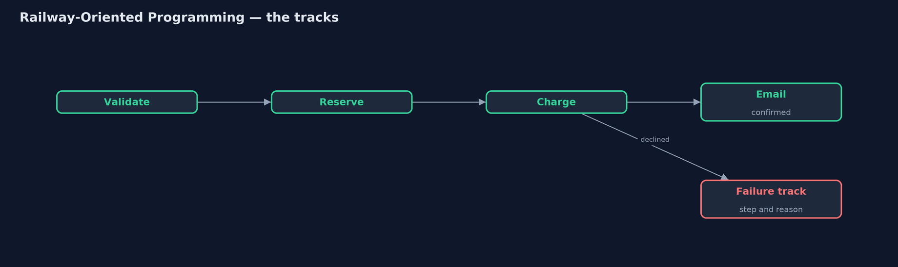
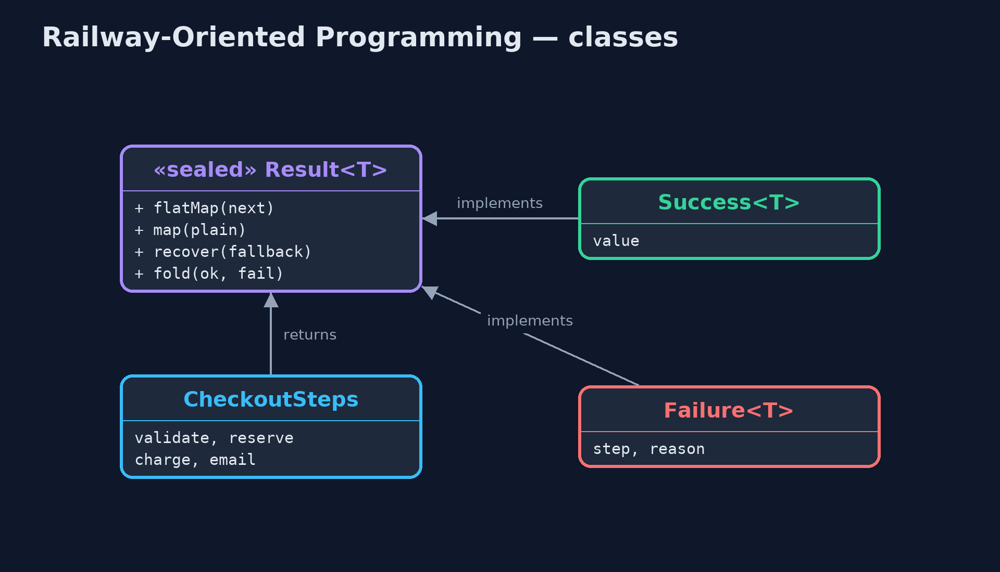
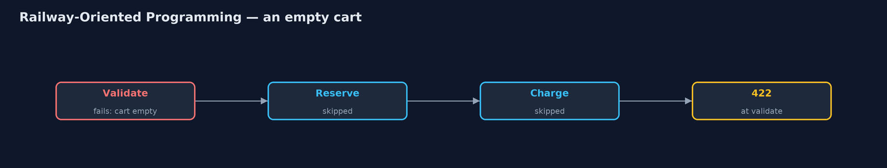
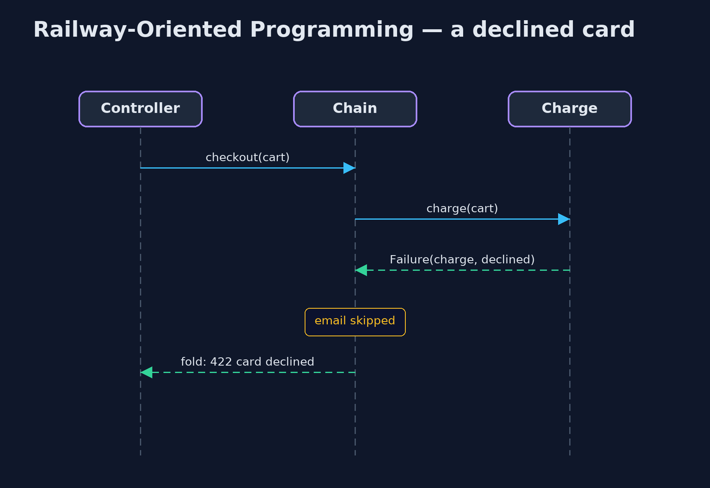

# Railway-Oriented Programming Pattern

```
src/main/java/com/jk/explore/railway/
├── Cart.java               A shopping cart, and how far through checkout it has got
├── CheckoutSteps.java      The four checkout steps
├── ExceptionCheckout.java  Before: each step throws its own exception, and the caller has to remember to catch every one
├── RailwayDemo.java        The five acts: exceptions the caller forgot, the happy track, switching to the failure track, plain functions and a way back, and the bill
└── Result.java             The two tracks: a step either succeeds with a value, or fails with a reason
```

**Let every step return a result that is either a success or a failure, and chain the steps so that the first failure switches to a failure track and the remaining steps are skipped.**

Railway-Oriented Programming is a functional way to handle errors in a chain
of steps. Each step returns a `Result`: either a success carrying a value, or
a failure carrying a reason. Picture two railway tracks side by side. Every
step runs on the success track; if it fails, the train switches to the
failure track, and every later step is skipped until the end of the line.

The chain reads as a straight list of steps, `validate`, then `reserve`, then
`charge`, then `email`, with no nested `if` statements and no exceptions to
forget. At the end, the caller must say what to do with both tracks, so no
failure can slip through unhandled. The name comes from Scott Wlaschin's
talks on functional programming.

## The idea in everyday terms

Think of an airport's baggage belt with inspection points. A healthy bag
rides past check-in, the scanner and loading. If the scanner rejects a bag,
it is pushed onto a side belt that runs straight to the end, where someone
must deal with it. No later station ever sees that bag, and no bag can vanish
without reaching one end or the other.

## The scenario

The online store's checkout had four steps: check the cart, reserve stock,
charge the card, email the confirmation. Each step threw its own exception,
and the web controller caught the ones its authors knew about. When the
payments team later added a "card declined" exception, nothing forced anyone
to catch it, and customers with declined cards saw "500 internal server
error".

## Run

```bash
./gradlew run
```

The demo tells the story in 5 acts, each printing exact numbers that the tests check:

| Act | What it shows |
| --- | --- |
| 1. Exceptions nobody caught | Out of stock is caught and returns 409; the declined-card exception, added later, was never caught, so the customer gets 500. |
| 2. The success track | Each step returns a Result and the steps are chained: 2 mugs with a good card are confirmed, and all four steps ran. |
| 3. Switching tracks | An empty cart fails at validate and the other three steps are skipped; a declined card fails at charge and email is skipped. |
| 4. Plain functions, and a way back | Adding 20% tax with map gives 23.98 for 2 mugs; recover turns an out-of-stock lamp into a back-order. |
| 5. The bill | An empty cart with no card reports only "the cart is empty": the first failure stops everything. |

## Test

```bash
./gradlew test
```

5 tests in `DemoRunsTest`, `ResultTest`. Every number the demo prints is asserted, and nothing depends on the clock, so every run gives the same result.

## Technologies and versions

| Technology | Version | Used for |
| --- | --- | --- |
| Java | 21 | the code (toolchain set in `build.gradle`) |
| Gradle | 9.2.1 (wrapper) | build and run, nothing to install |
| JUnit | 5.10.2 | the tests |
| videokit | repository tool | the narrated video and animation: Piper `en_US-amy-medium`, speed 0.8, longer pauses (the approved `amy-slow` voice) |

## Learning Material

| Document | What it is for |
| --- | --- |
| [Problem statement](docs/problem-statement.md) | the situation and what the project must show |
| [Prerequisites](docs/prerequisites.md) | what you need to know first |
| [Railway-Oriented Programming, explained](docs/railway-oriented-pattern-explained.md) | the acts in prose |
| [Session guide](docs/session.md) | a one-hour lesson with exercises |
| [Animated walkthrough](docs/animation.html) | the acts step by step, narrated |
| [Spec](docs/spec.md) | what this project must be true of |

### The pattern in one picture

A failure switches tracks; later steps are skipped.



### Where each piece sits

A sealed Result with two cases.



### How the data moves

Only the first step runs.



### Who calls whom, in order

Charge fails; email never runs.



### Video

`video/railway-oriented-pattern-explained.mp4` (with `.m4a` audio and `.srt` subtitles) is built by `video/build_video.sh`. Rendered media is not committed.

## What it costs

- **First failure only.** The chain stops at the first problem, so an empty cart with no card reports only the empty cart; showing every form error needs a different tool.
- **An unfamiliar style in Java.** `flatMap` chains and a home-made `Result` type are new to many Java developers.
- **Not for everything.** Truly unexpected failures, such as running out of memory, are still best left as exceptions.

## When this is too much

For one or two steps, an `if` statement is clearer. The railway pays off for
longer chains of steps that can each fail for business reasons.

## Where you have already met this

- `Optional.map` and `flatMap`, a railway whose failure track has no reason.
- `CompletableFuture.thenCompose` and `exceptionally`.
- Vavr's `Try` and `Either`, Kotlin's `Result`, Rust's `Result` and its `?` operator.

## Where this sits

This project is in [functional-design-patterns](..), the first project of that
category.
