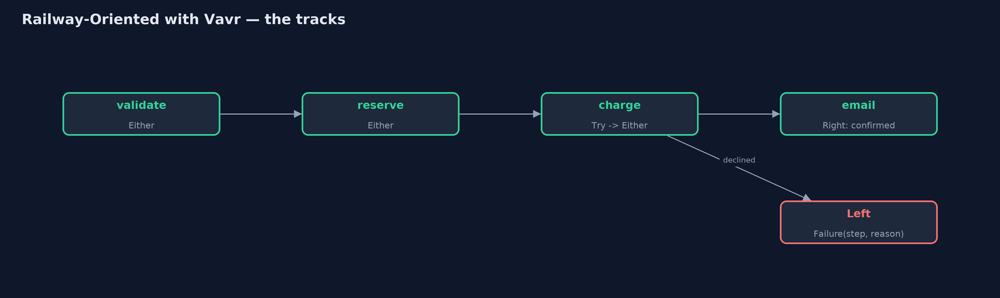
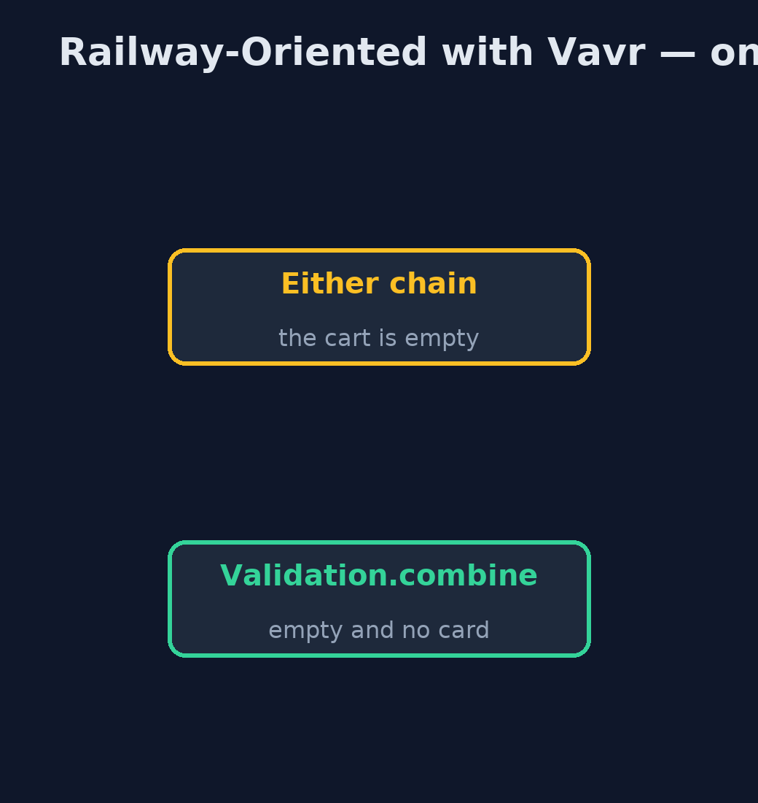
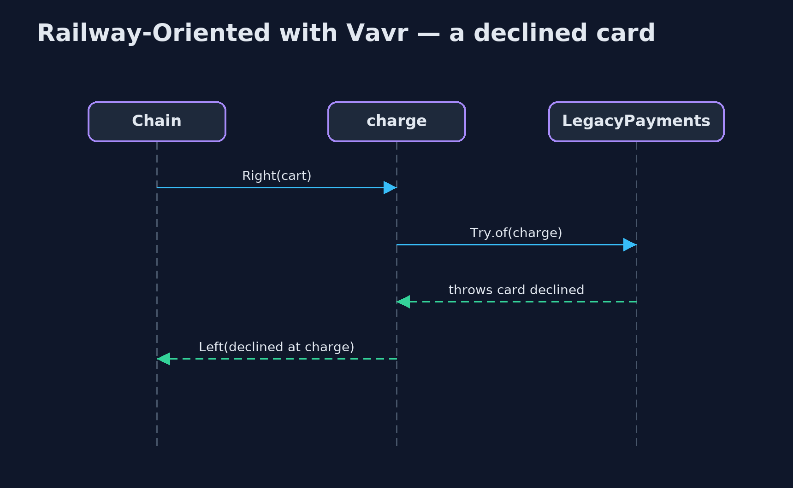

# Railway-Oriented Programming with Vavr Pattern

```
src/main/java/com/jk/explore/railwayvavr/
├── Cart.java             A shopping cart, and how far through checkout it has got
├── CheckoutSteps.java    The checkout steps
├── Failure.java          Why checkout failed, and at which step
├── LegacyPayments.java   The payment company's client library: it reports a declined card by throwing, as much Java code does
└── VavrRailwayDemo.java  The five acts, with Vavr's Either, Try and Validation
```

**Build the checkout railway with Vavr: Either for the two tracks, Try to move a throwing library onto them, and Validation to collect every problem in a form instead of stopping at the first.**

This is the library version of Railway-Oriented Programming. The plain Java
version, a separate project in this category, writes its own sealed Result
type. Here Vavr, the best-known functional library for Java, provides the
types. `Either<Failure, Cart>` is the railway: Left is the failure track,
Right the success track, and `flatMap` runs the next step only on the success
track.

Vavr adds two things the plain version did not have. `Try` wraps code that
throws, such as a payment company's client library, and `toEither()` puts its
exception onto the failure track. And `Validation` checks several fields
independently and collects every problem, which the plain version named as
the railway's limit.

## The idea in everyday terms

Think of an airport baggage belt with inspection points: a rejected bag is
pushed onto a side belt that runs to the end. That is Either. Try is a
station that catches a bag falling off the belt and puts it on the side belt
instead of on the floor. Validation is a customs desk that checks every item
in a bag and lists all the problems at once.

## The scenario

The online store's checkout has four steps: check the cart, reserve stock,
charge the card, email the confirmation. The payment company's client library
reports a declined card by throwing an exception, and a controller that forgot
to catch it showed customers an internal server error.

## Run

Nothing to install beyond a Java 21 JDK: Vavr is a library, downloaded by
Gradle.

```bash
./gradlew run
```

The demo tells the story in 5 acts, each printing exact numbers that the tests check:

| Act | What it shows |
| --- | --- |
| 1. A throwing library | The payment library throws "card declined"; nothing makes the caller handle it. |
| 2. Either | Each step returns Either<Failure, Cart>, chained with flatMap: 2 mugs and a good card are confirmed, and all four steps ran. |
| 3. Skipping, and Try | An empty cart fails at validate and skips the rest; a declined card fails at charge, because Try.of(...).toEither() caught the library's exception. |
| 4. map and orElse | 20% tax with map gives 23.98 for 2 mugs; an out-of-stock lamp becomes a back-order with orElse. |
| 5. Validation | An empty cart with no card: the Either chain reports only the empty cart; Validation.combine reports both problems. |

## Test

```bash
./gradlew test
```

1 tests in `DemoRunsTest`. Every number the demo prints is asserted, and nothing depends on the clock, so every run gives the same result.

## What the simulation got right, and what it left out

The plain Java version got the idea right: steps return success or failure,
flatMap skips the rest after the first failure, map lifts plain steps, and
there is a way back; and it named the limit, that a chain reports only the
first problem. What it left out is a standard library for it. Vavr's Either
is the railway, used across many codebases. Try brings code that throws onto
the railway. And Validation removes the limit the plain version admitted: an
empty cart with no card now reports both problems at once.

## Technologies and versions

| Technology | Version | Used for |
| --- | --- | --- |
| Java | 21 | the code (toolchain set in `build.gradle`) |
| Gradle | 9.2.1 (wrapper) | build and run, nothing to install |
| JUnit | 5.10.2 | the tests |
| Vavr | 1.0.1 | Either, Try and Validation |
| videokit | repository tool | the narrated video and animation: Piper `en_US-amy-medium`, speed 0.8, longer pauses (the approved `amy-slow` voice) |

## Learning Material

| Document | What it is for |
| --- | --- |
| [Dependencies](docs/dependencies.md) | what the framework and infrastructure are, and why they are here |
| [Problem statement](docs/problem-statement.md) | the situation and what the project must show |
| [Prerequisites](docs/prerequisites.md) | what you need to know first |
| [Railway-Oriented Programming with Vavr, explained](docs/railway-oriented-with-vavr-pattern-explained.md) | the acts in prose |
| [Session guide](docs/session.md) | a one-hour lesson with exercises |
| [Animated walkthrough](docs/animation.html) | the acts step by step, narrated |
| [Spec](docs/spec.md) | what this project must be true of |

### The pattern in one picture

Right carries on; Left runs to the end.



### Where each piece sits

Vavr supplies the tracks.


### How the data moves

Either stops; Validation collects.



### Who calls whom, in order

The exception becomes a Left.



### Video

`video/railway-oriented-with-vavr-pattern-explained.mp4` (with `.m4a` audio and `.srt` subtitles) is built by `video/build_video.sh`. Rendered media is not committed.

## What it costs

- **A library to learn and carry.** Either, Try and Validation each have their own methods.
- **Left and Right.** Which side is failure is a convention, easy to mix up at first.
- **Two tools for two jobs.** Either stops at the first failure; Validation collects them all; choose on purpose.

## When this is too much

For one or two steps, an if statement is clearer than a library. Vavr pays off
in code with many steps that can fail for business reasons, or many fields to
check.

## Where you have already met this

- Vavr's `Either`, `Try` and `Validation` in Java codebases.
- Kotlin's `Result` and Arrow's `Either`.
- Scala's `Either` and `Try`, which Vavr is modelled on.

## Where this sits

This project is in [functional-design-patterns](..). It is the library
version of the plain Java Railway-Oriented Programming project in the same
category, which is left unchanged.
