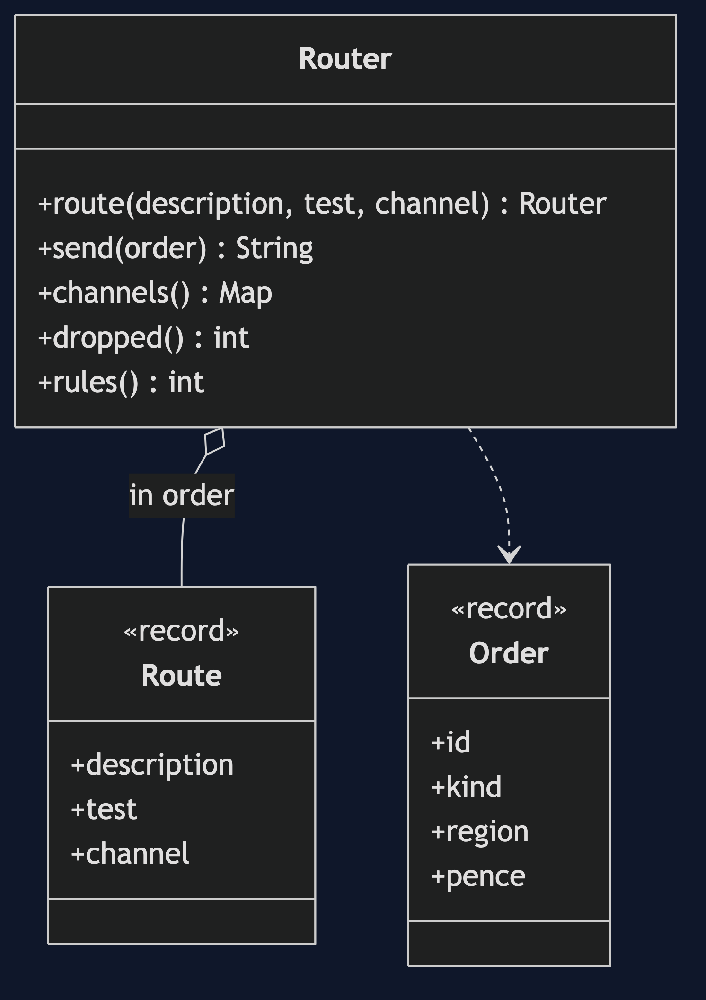
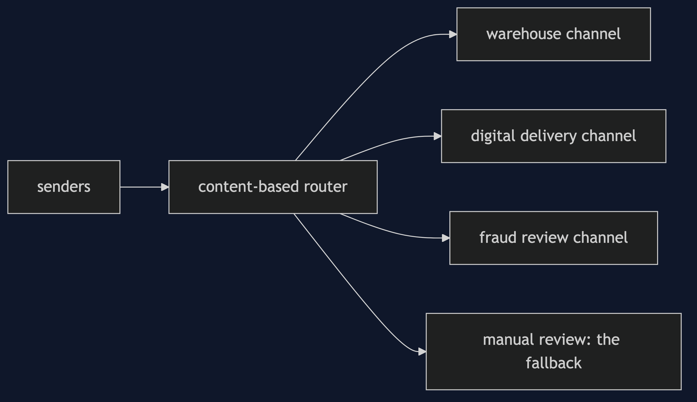
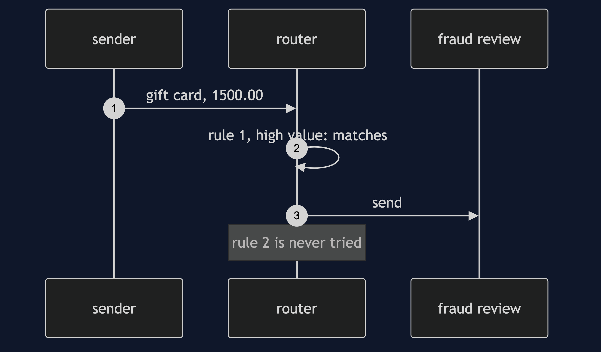

# Content-Based Router Pattern

```
src/main/java/com/jk/explore/contentrouter/
├── ContentRouterDemo.java           the six acts
├── Router.java                      ordered rules, a fallback, and a count of what it drops
├── Route.java  Order.java
```

**A content-based router reads a message and sends it where its content says, in one place.**

This is the second project in [messaging-integration-patterns](..). It sits after a [Message Channel](../message-channel-pattern) and decides which channel a message joins. It is the messaging form of [Strategy](../../behavioural/strategy-pattern) applied to destinations.

## Run

```bash
./gradlew run
```

Six acts. Every number quoted below comes from this program's own output.

```
ONE. One channel for everything.
  all 6 orders arrive on the warehouse's channel. 2 are gift cards, which nothing physical can be done for, and 1 is neither.
  the warehouse now has an if for each kind, and every new kind means changing the warehouse.
TWO. A router looks inside.
  ORD-1 (physical, UK, 4999) -> warehouse
  ORD-2 (gift-card, UK, 2500) -> digital-delivery
  ORD-3 (physical, EU, 120000) -> fraud-review
  ORD-4 (gift-card, UK, 90000) -> digital-delivery
  ORD-5 (subscription, UK, 999) -> manual-review
  ORD-6 (physical, EU, 3000) -> warehouse
  {warehouse=[ORD-1, ORD-6], digital-delivery=[ORD-2, ORD-4], fraud-review=[ORD-3], manual-review=[ORD-5]}.
THREE. The first rule that matches wins.
  a gift card for 1500.00. with 'high value' first: fraud-review. with it last: digital-delivery.
  the order of the rules is part of the design, and nothing warns you when it changes.
FOUR. Nothing matches.
  a subscription order, which no rule covers. with a fallback channel: manual-review.
  with no fallback: nowhere. orders dropped and counted: 1.
  a router with no fallback loses what it does not recognise, and says nothing.
FIVE. A new route, and nobody else changes.
  rules before: 3, after: 4. senders and receivers were not touched.
  an EU subscription, which nothing before it covers, now goes to: eu-vat-check.
  ORD-6 (physical, EU) still goes to: warehouse, because an earlier rule matched first.
SIX. The bill.
  the sender starts calling physical orders 'goods'. the router's rule looks for 'physical': manual-review.
  the router reads the content, so it is coupled to the content's format. routing on a header keeps that in the envelope, at the cost of the sender having to fill it in.
  every route is a rule to test, and rules grow: this shop has 3 today.
```

## Test

```bash
./gradlew test
```

2 test classes, 7 test methods, offline, with nothing installed and no framework.

## Technologies and versions

| What | Version | Why it is here |
| --- | --- | --- |
| Java | 21 | The repository standard, via the Gradle toolchain block |
| Gradle | 9.2.1 | The wrapper in this directory; no separate install needed |
| JUnit 5 | 5.10.2 | Test runner |

No framework. A hand-built project stays plain Java so the mechanism is the whole lesson.

## Learning Material

| Document | What it covers |
| --- | --- |
| [`docs/problem-statement.md`](docs/problem-statement.md) | The scenario, and the problem |
| [`docs/content-based-router-pattern-explained.md`](docs/content-based-router-pattern-explained.md) | The pattern, and six acts |
| [`docs/class-diagram.md`](docs/class-diagram.md) | The types |
| [`docs/architecture-diagram.md`](docs/architecture-diagram.md) | The parts and how they connect |
| [`docs/data-flow-diagram.md`](docs/data-flow-diagram.md) | What happens to one request |
| [`docs/sequence-diagram.md`](docs/sequence-diagram.md) | Written for a listener with the screen off |
| [`docs/uml-diagram.md`](docs/uml-diagram.md) | Four sequences |
| [`docs/animation.html`](docs/animation.html) | The six acts in a browser |
| [`docs/prerequisites.md`](docs/prerequisites.md) | What you need to know |
| [`docs/session.md`](docs/session.md) | A one-hour taught session |
| [`docs/spec.md`](docs/spec.md) | The generated specification |
| [`docs/youtube.md`](docs/youtube.md) | Title, description and chapters |

### The pattern in one picture



### Where each piece sits



### How one request moves


### Who calls whom, in order



### All four sequences


### Video

Built from [`video/scenes.py`](video/scenes.py) by
[`video/build_video.sh`](video/build_video.sh). The rendered file is not
committed; see the repository README for why.

## Where you have already met this

Enterprise service buses, API gateways that route by path, and mail rules that file messages by sender.

## When this is too much

If there is only one destination, or the sender already knows where each message goes, a router is a step for nothing.

## Where this sits

This project is in [`messaging-integration-patterns`](..), and is meant to be read with its neighbours there.
