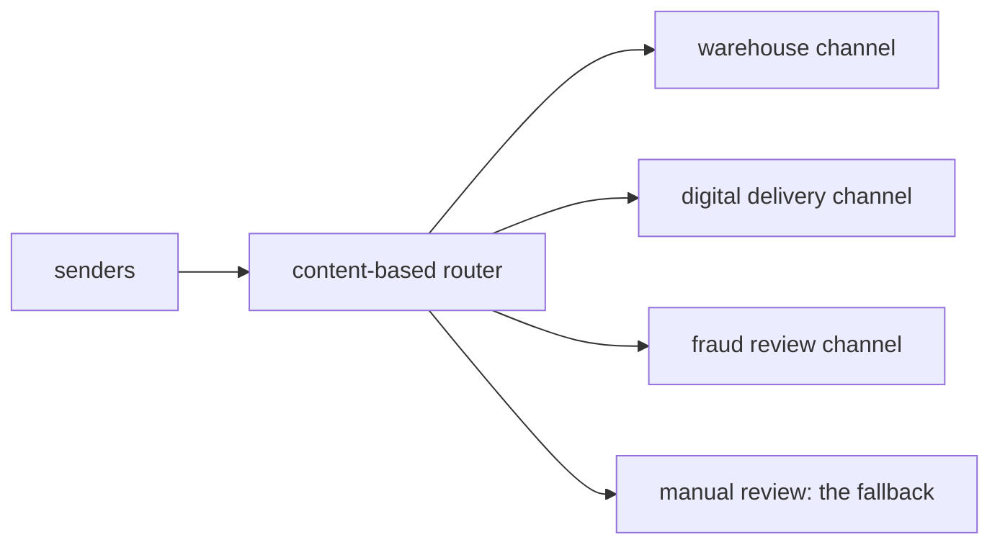

# Content-Based Router Pattern — Architecture Diagram

Senders send to the router. Receivers read their own channel.

Mermaid source

```mermaid
flowchart LR
    S["senders"] --> R["content-based router"]
    R --> W["warehouse channel"]
    R --> D["digital delivery channel"]
    R --> F["fraud review channel"]
    R --> M["manual review: the fallback"]
```

