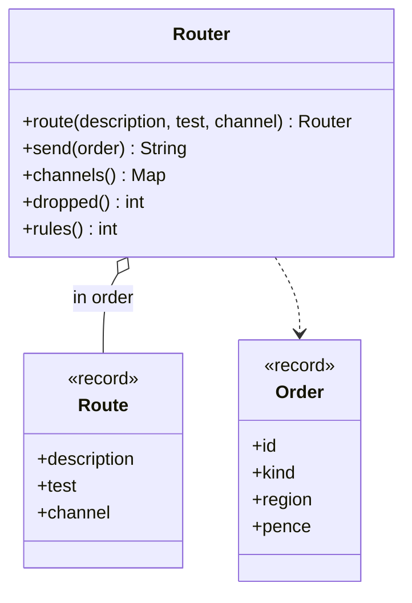

# Content-Based Router Pattern — Class Diagram

A router holds ordered routes and a fallback.

Mermaid source

```mermaid
classDiagram
    class Router {
        +route(description, test, channel) Router
        +send(order) String
        +channels() Map
        +dropped() int
        +rules() int
    }
    class Route {
        <<record>>
        +description
        +test
        +channel
    }
    class Order {
        <<record>>
        +id
        +kind
        +region
        +pence
    }
    Router o-- Route : in order
    Router ..> Order
```

