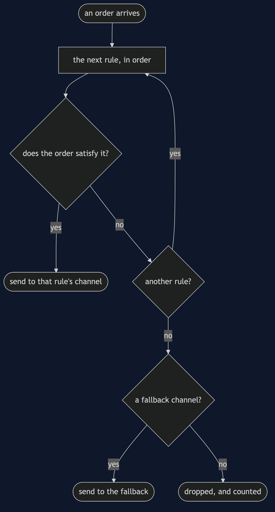
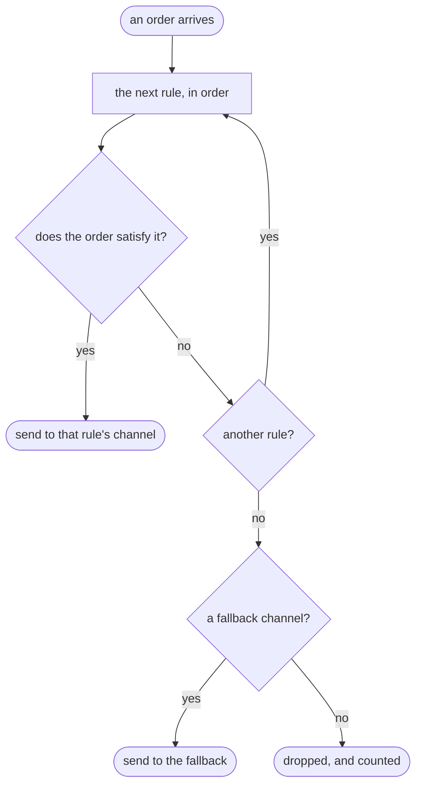

# Content-Based Router Pattern — Data Flow Diagram

What the router does with one order.

Mermaid source

```mermaid
flowchart TD
    Order(["an order arrives"])
    Next["the next rule, in order"]
    Match{"does the order satisfy it?"}
    Send(["send to that rule's channel"])
    More{"another rule?"}
    Fb{"a fallback channel?"}
    Fall(["send to the fallback"])
    Drop(["dropped, and counted"])
    Order --> Next --> Match
    Match -- yes --> Send
    Match -- no --> More
    More -- yes --> Next
    More -- no --> Fb
    Fb -- yes --> Fall
    Fb -- no --> Drop
```

