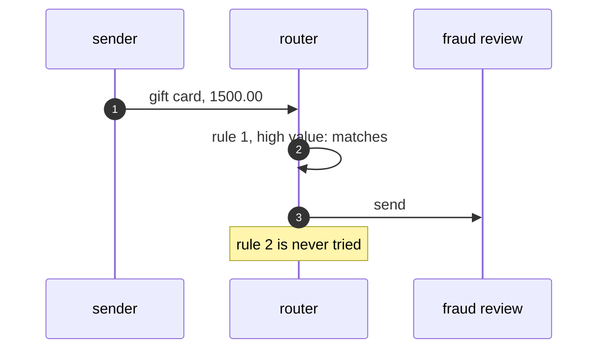

# Content-Based Router Pattern — Sequence Diagram

Written for a listener with the screen off.

Say it in words. An order for a gift card worth fifteen hundred pounds reaches the router. The router tries its first rule, high value, and the order satisfies it, so the router sends it to fraud review and stops. It never tries the gift card rule. If the rules had been the other way round, the gift card rule would have matched first, and the order would have gone to digital delivery.

Mermaid source

The load-bearing sentence: **the order of the rules decides where a message goes.**
