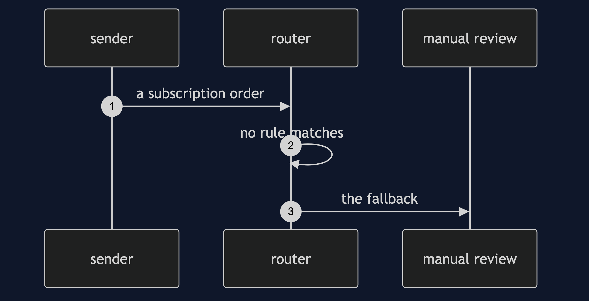
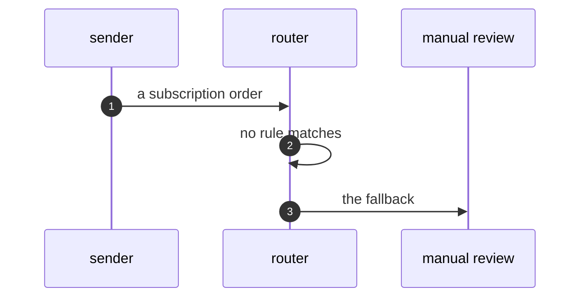

# Content-Based Router Pattern — UML Sequence Diagrams

Four sequences.

## 1. No Match

Mermaid source

```mermaid
sequenceDiagram
    autonumber
    participant S as sender
    participant R as router
    participant M as manual review
    S->>R: a subscription order
    R->>R: no rule matches
    R->>M: the fallback
```

