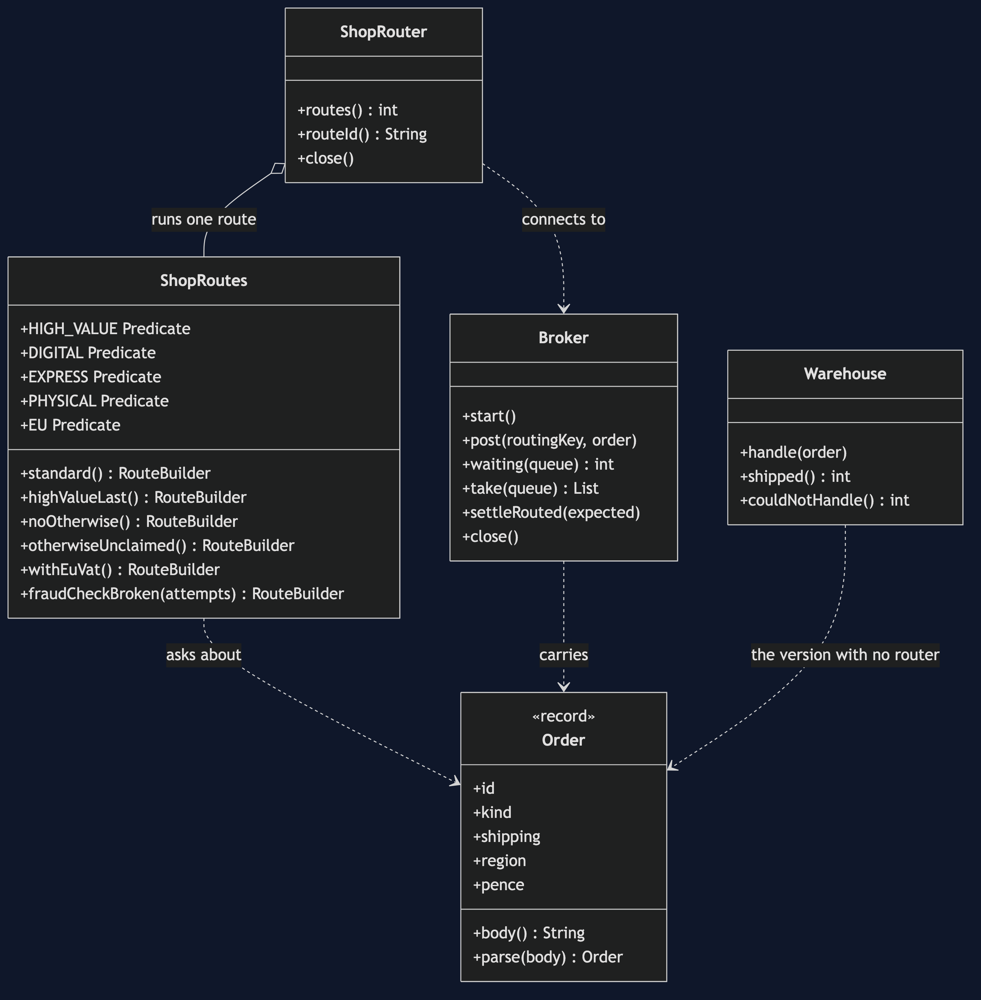
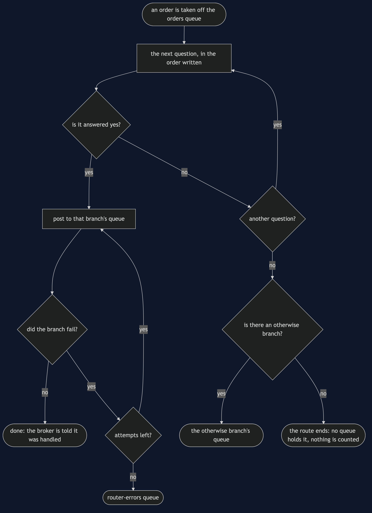
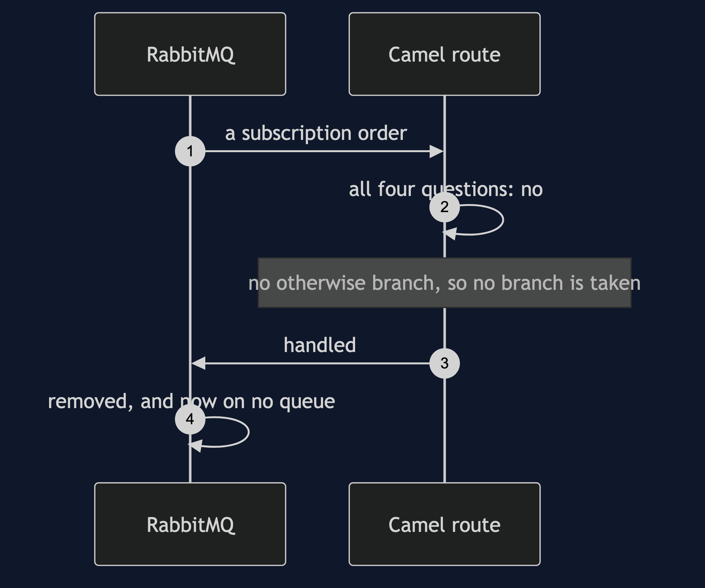
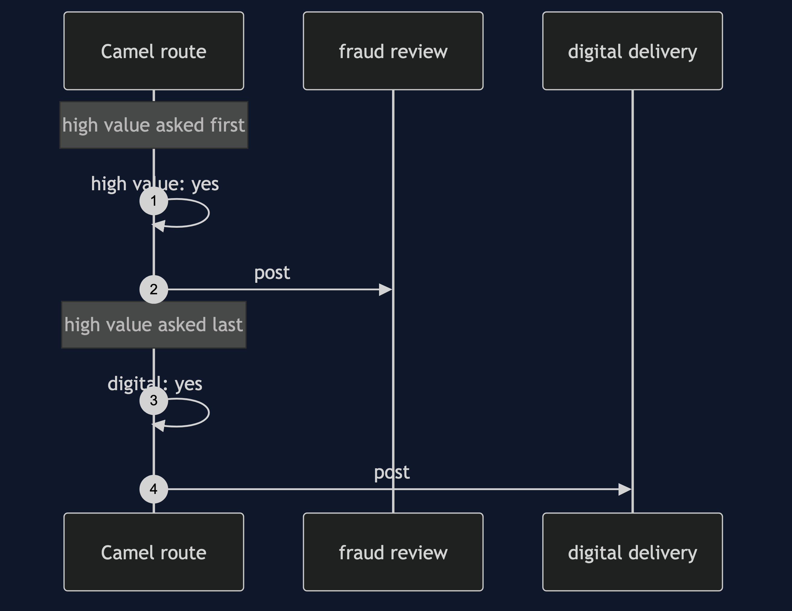
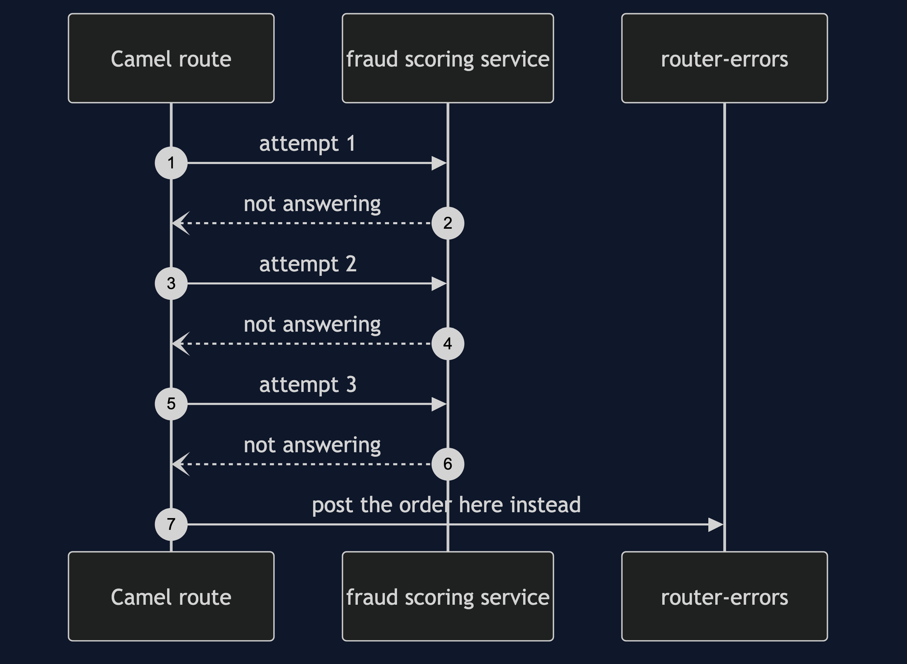
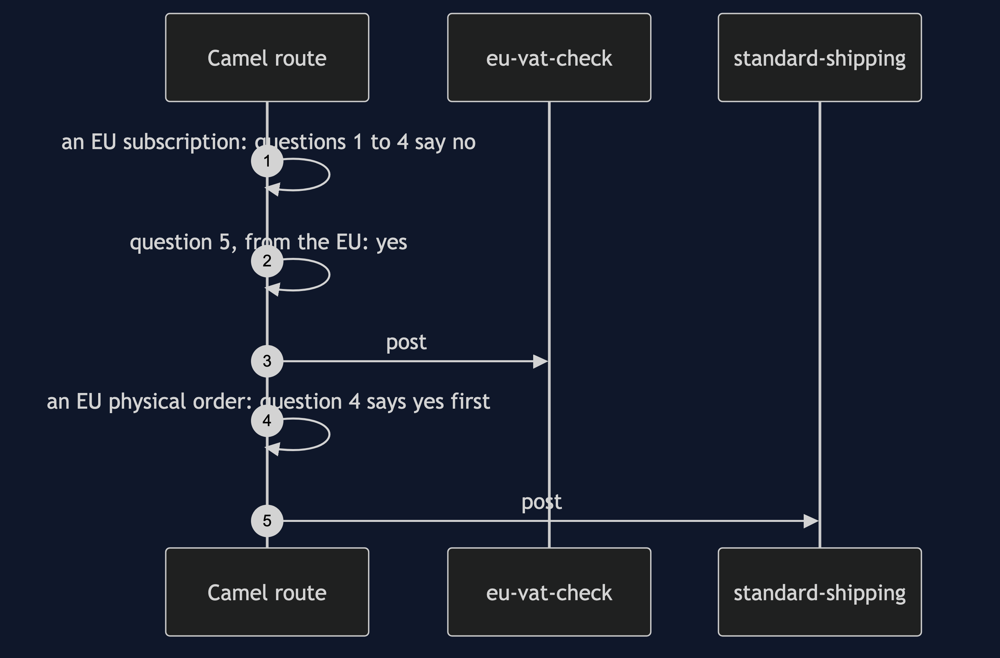

# Content-Based Router with Camel Pattern

```
src/main/java/com/jk/explore/camelrouter/
├── CamelRouterDemo.java   the six acts
├── ShopRoutes.java        the declared routes: the questions, their order, and the otherwise branch
├── ShopRouter.java        starts and stops the Camel engine with one route in it
├── Broker.java            the RabbitMQ container: one exchange, ten queues, and bounded waits
├── Warehouse.java         the before picture: one queue, and an if for every kind of order
├── Order.java             the order as plain text on the wire
```

**With Camel, the routing is a declared list of yes-or-no questions, and a message that every question answers no to is kept only if the route says where to keep it.**

**This project needs a container runtime.** It starts a real RabbitMQ broker in a container, and removes it again when the demo ends. With no runtime running, `./gradlew run` says so in two plain sentences and stops, and the broker tests are skipped rather than failed.

This project is the real-infrastructure version of [Content-Based Router](../content-based-router-pattern). That project built the router by hand: a list of rules in order, a fallback, and a count of what it dropped. This one runs the same idea as an Apache Camel route, reading orders off a real RabbitMQ queue and posting each one to the queue its content asks for. It does not re-teach the pattern. It shows what Camel does with a message no question claims, and what happens when a branch fails rather than merely misses.

## Run

```bash
./gradlew run
```

Docker, or another Docker-compatible runtime, has to be running. The first run pulls the broker image; after that a run takes about twenty seconds. Every number below is that run's own output, and two runs one after the other print the same thing.

```
ONE. One queue for everything.
  all 6 orders arrived on the warehouse's own queue. it shipped 3 and could do nothing with 3.
  the warehouse now holds an if for every kind of order, and every new kind means changing the warehouse.
TWO. The route reads the content and chooses.
  ORD-1 (physical, express, UK, 49.99) -> express-shipping
  ORD-2 (digital, none, UK, 25.00) -> digital-delivery
  ORD-3 (physical, standard, EU, 1200.00) -> fraud-review
  ORD-4 (digital, none, UK, 900.00) -> digital-delivery
  ORD-5 (subscription, none, UK, 9.99) -> manual-review
  ORD-6 (physical, standard, EU, 30.00) -> standard-shipping
  {express-shipping=[ORD-1], standard-shipping=[ORD-6], digital-delivery=[ORD-2, ORD-4], fraud-review=[ORD-3], manual-review=[ORD-5]}.
  the shop's route asks 4 questions about the content in a fixed order, and nothing but the route knows the answers.
THREE. The first question answered yes wins.
  a digital gift card worth 1500.00. with the high value question asked first: fraud-review. with it asked last: digital-delivery.
  the order of the questions is part of the design, and Camel does not warn you when it changes.
FOUR. A message no question claims.
  a subscription order, which no question covers. with an otherwise branch it goes to: manual-review.
  with no otherwise branch the route simply ends. messages left anywhere in the shop: 0. the broker was told it was handled, so it is gone.
  an otherwise branch that names the problem sends it to: unclaimed, where somebody can look at it. that queue is the whole difference between a lost order and a known one.
FIVE. A new question, and nobody else changes.
  questions before: 4, after: 5. the senders and the receiving queues were not touched; only the route was.
  an EU subscription used to go to manual-review. it now goes to: eu-vat-check.
  ORD-6, physical and from the EU, still goes to: standard-shipping, because an earlier question was answered yes first.
SIX. The bill.
  the sender starts calling physical orders goods. the route's question still looks for physical, so ORD-9 lands on: manual-review, quietly.
  the fraud branch is broken. Camel tried it 3 times and then put the order on router-errors, which now holds 1. a route can fail as well as choose, and somebody has to say where the failures go.
  and the routing is now a broker and a route to keep running: this demo needed 1 container, 1 exchange and 10 queues.
```

Prices are printed in pounds. On the wire they travel as whole pence, so `1200.00` is sent as `pence=120000`.

## Test

```bash
./gradlew test
```

2 test classes, 12 test methods. Three of them need nothing running; the other nine share one RabbitMQ container, started once for the class and removed at the end. Nothing under `src/test` sleeps for a fixed length of time. Every wait is a loop that asks the broker how many messages each queue is holding, keeps asking for half a second after the count is reached so that a late arrival would be noticed, and gives up with a sentence after sixty seconds rather than hanging.

## What the simulation got right, and what it left out

This is the reason this project exists, so it comes before anything else.

**What [Content-Based Router](../content-based-router-pattern) got right.** The idea, exactly. The rules are asked in a deliberate order and the first one that matches wins, so moving the high-value rule changes where a gift card goes. There is a fallback for anything no rule covers. A new rule is added without touching any sender or receiver. And a router that reads the body is coupled to the body's wording, so a sender who renames a field quietly sends everything to the fallback. Every one of those lessons is true of Camel, and the hand-built version teaches them in a few dozen lines you can read in one sitting.

**What it left out, first and most important: nothing counts the message that nobody claimed.** In the simulation, a router with no fallback dropped the unclaimed order and *counted* it — `orders dropped and counted: 1` — so the loss was a number you could see and assert on. Camel keeps no such count. A `choice` whose questions all say no, with no `otherwise` branch, simply ends. The route then tells the broker the message was handled, and the broker deletes it. The fourth act counts every message on all ten queues afterwards and finds `0`. Nothing was logged and nobody was told. You find out when a customer asks where their order went.

**Second: a branch can fail, which is not the same as not matching.** The simulation's rules were pure tests that could only say yes or no. In a real route a branch calls something, and that something can be down. The sixth act breaks the fraud check: Camel tried it `3` times — the first attempt and the two retries it was told to make — and then put the order on `router-errors`, which ended up holding `1`. That destination is a second design decision, separate from the otherwise branch. Leave out the error handler and a failing message is lost the same way an unclaimed one is.

**Third: the message really leaves the process.** In the simulation the router was a method you called, in the same program and on the same thread as the sender. Here the order is posted to a broker by one piece of code and taken off a different queue by another, with RabbitMQ holding it in between. That is also why the demo cannot simply read a return value: it has to ask the broker how many messages each queue holds, and wait until those counts stop changing.

**Fourth: there is something to run.** The simulation had no running cost. This demo needed `1` container, `1` exchange and `10` queues, a route to deploy, and a second way of describing behaviour that every reader of the codebase has to learn.

**What Camel adds that is simply free.** The route reads top to bottom as the path an order takes, in one place. Retries and an errors queue are two lines of configuration rather than code you write and test. And the same route could read from a different broker, or a file, or an HTTP endpoint, by changing one address.

## Technologies and versions

| What | Version | Why it is here |
| --- | --- | --- |
| Java | 21 | The repository standard, via the Gradle toolchain block |
| Gradle | 9.2.1 | The wrapper in this directory |
| Apache Camel | 4.20.0 | The routing engine: `choice`, `when`, `otherwise`, and the dead letter error handler (`camel-core`, `camel-spring-rabbitmq`) |
| Spring AMQP | 4.0.3 | Pulled in by `camel-spring-rabbitmq`; it holds Camel's connection to the broker |
| RabbitMQ | 4.3.6, image `rabbitmq:4.3.6-alpine` | The broker, in a container the demo starts and removes |
| RabbitMQ Java client | 5.36.0 | Used by the demo to post orders and to count what is on each queue |
| Testcontainers | 2.0.5 (`testcontainers-rabbitmq`) | Starts and stops the broker container, in the demo and in the tests |
| slf4j-simple | 2.0.17 | The libraries' logging, held at error so the demo's own output is the only output |
| JUnit 5 | 5.10.2 | Test runner |
| Docker | 24 or later, running | The container runtime |

Every version is the newest generally available release at the time of writing. See [`docs/dependencies.md`](docs/dependencies.md) and [`docs/prerequisites.md`](docs/prerequisites.md).

## Learning Material

| Document | What it covers |
| --- | --- |
| [`docs/problem-statement.md`](docs/problem-statement.md) | The partner's version, and what is new |
| [`docs/content-based-router-with-camel-pattern-explained.md`](docs/content-based-router-with-camel-pattern-explained.md) | A declared route, and the message nothing claims |
| [`docs/class-diagram.md`](docs/class-diagram.md) | The types |
| [`docs/architecture-diagram.md`](docs/architecture-diagram.md) | The broker, the route, and the queues it chooses between |
| [`docs/data-flow-diagram.md`](docs/data-flow-diagram.md) | What the route does with one order, including the two ways it ends badly |
| [`docs/sequence-diagram.md`](docs/sequence-diagram.md) | Written for a listener with the screen off |
| [`docs/uml-diagram.md`](docs/uml-diagram.md) | Four sequences |
| [`docs/animation.html`](docs/animation.html) | The six acts in a browser |
| [`docs/prerequisites.md`](docs/prerequisites.md) | What you need to know and to have installed |
| [`docs/session.md`](docs/session.md) | A one-hour taught session |
| [`docs/dependencies.md`](docs/dependencies.md) | What Apache Camel and RabbitMQ are, what they cost, and that skipping this project loses none of the pattern |
| [`docs/spec.md`](docs/spec.md) | The generated specification |
| [`docs/youtube.md`](docs/youtube.md) | Title, description and chapters |

### The pattern in one picture



### Where each piece sits


### How one request moves



### Who calls whom, in order


### All four sequences









### Video

Built from [`video/scenes.py`](video/scenes.py) by
[`video/build_video.sh`](video/build_video.sh). The rendered file is not
committed; see the repository README for why.

## Where you have already met this

Anywhere one stream of messages carries several kinds of work: orders split between the warehouse, the download service and a fraud team; support tickets sent to billing or to technical support by what they say; invoices routed by country for tax. Camel's `choice().when().otherwise()`, Spring Integration's `router`, a RabbitMQ topic exchange with several bindings, and an `if` chain inside a message listener are all this pattern. A queue called `unroutable`, `parking-lot` or `manual-review` is somebody's otherwise branch.

## When this is too much

If every message goes to the same place, there is nothing to route. If the routing is two or three stable rules inside one program, the hand-built version in the partner project is smaller and clearer, and needs no broker. If the sender already knows the destination, let it post straight to the right queue, or put the answer in a header the broker can route on. And a framework is a thing to learn: a route is easy to read and hard to guess, and nothing warns you when somebody reorders its questions.

## Where this sits

This project pairs with [Content-Based Router](../content-based-router-pattern), and is the real-infrastructure version in [`messaging-integration-patterns`](..).
