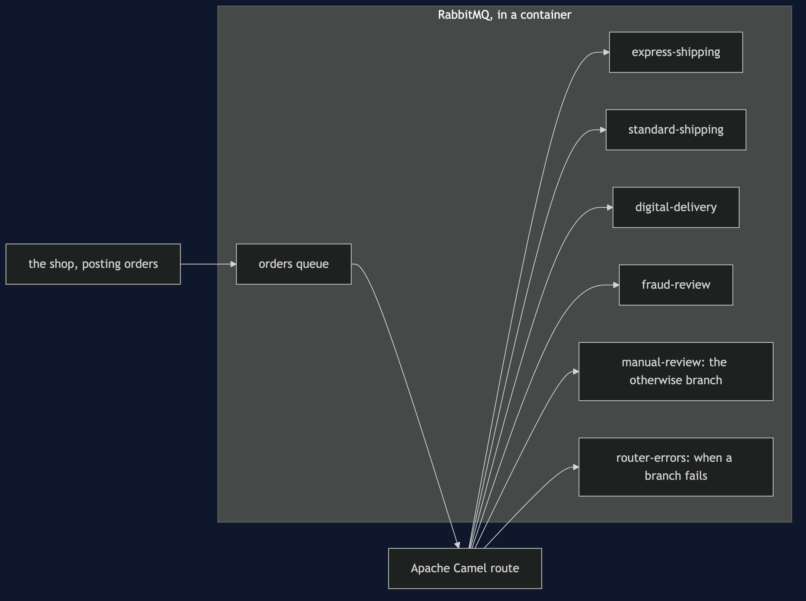
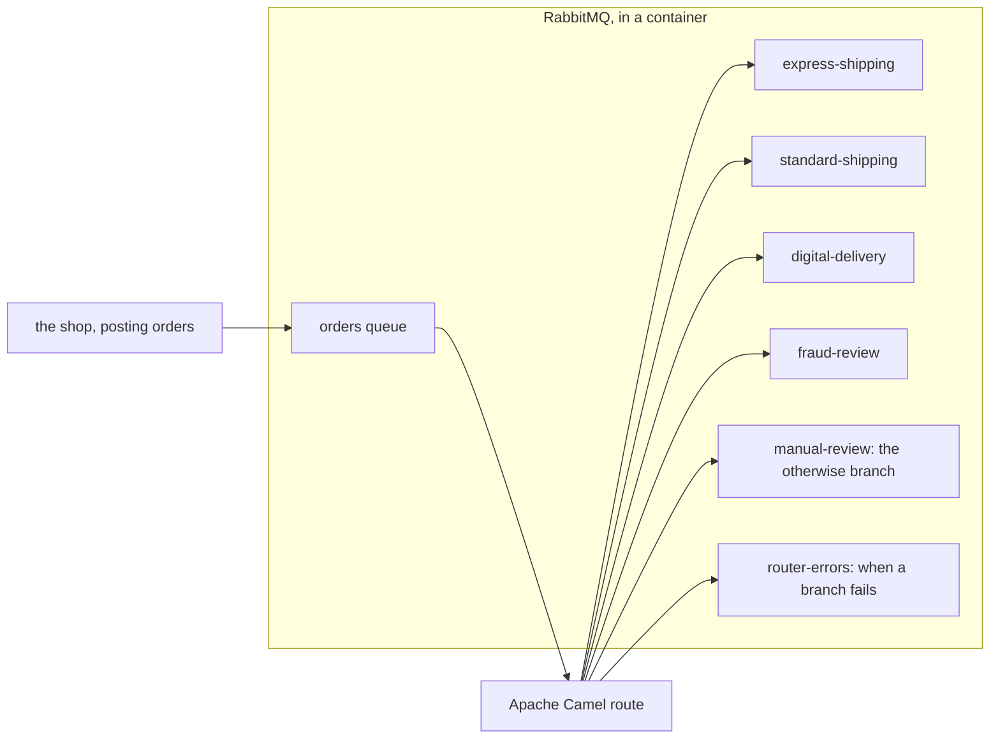

# Content-Based Router with Camel Pattern — Architecture Diagram

Senders post to one queue. A Camel route reads it and posts each order on again. Receivers read only their own queue.

Mermaid source

