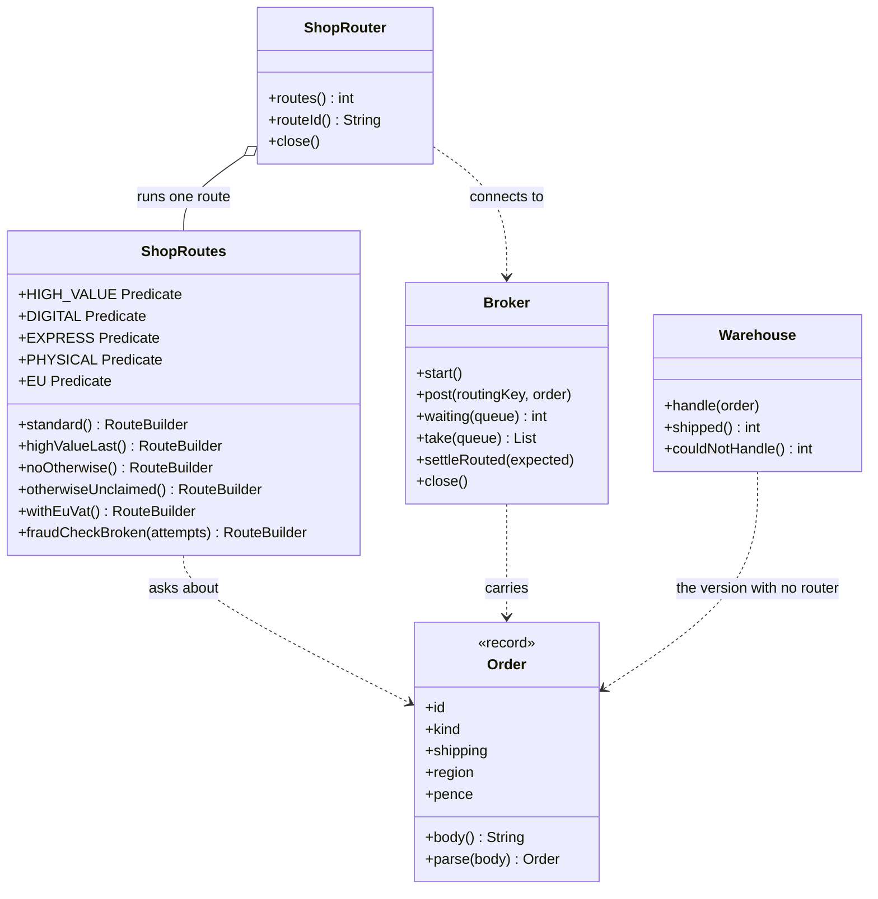

# Content-Based Router with Camel Pattern — Class Diagram

The route holds the questions. The broker holds the queues. Nothing else knows either.

Mermaid source

```mermaid
classDiagram
    class ShopRoutes {
        +standard() RouteBuilder
        +highValueLast() RouteBuilder
        +noOtherwise() RouteBuilder
        +otherwiseUnclaimed() RouteBuilder
        +withEuVat() RouteBuilder
        +fraudCheckBroken(attempts) RouteBuilder
        +HIGH_VALUE Predicate
        +DIGITAL Predicate
        +EXPRESS Predicate
        +PHYSICAL Predicate
        +EU Predicate
    }
    class ShopRouter {
        +routes() int
        +routeId() String
        +close()
    }
    class Broker {
        +start()
        +post(routingKey, order)
        +waiting(queue) int
        +take(queue) List
        +settleRouted(expected)
        +close()
    }
    class Order {
        <<record>>
        +id
        +kind
        +shipping
        +region
        +pence
        +body() String
        +parse(body) Order
    }
    class Warehouse {
        +handle(order)
        +shipped() int
        +couldNotHandle() int
    }
    ShopRouter o-- ShopRoutes : runs one route
    ShopRouter ..> Broker : connects to
    ShopRoutes ..> Order : asks about
    Broker ..> Order : carries
    Warehouse ..> Order : the version with no router
```

