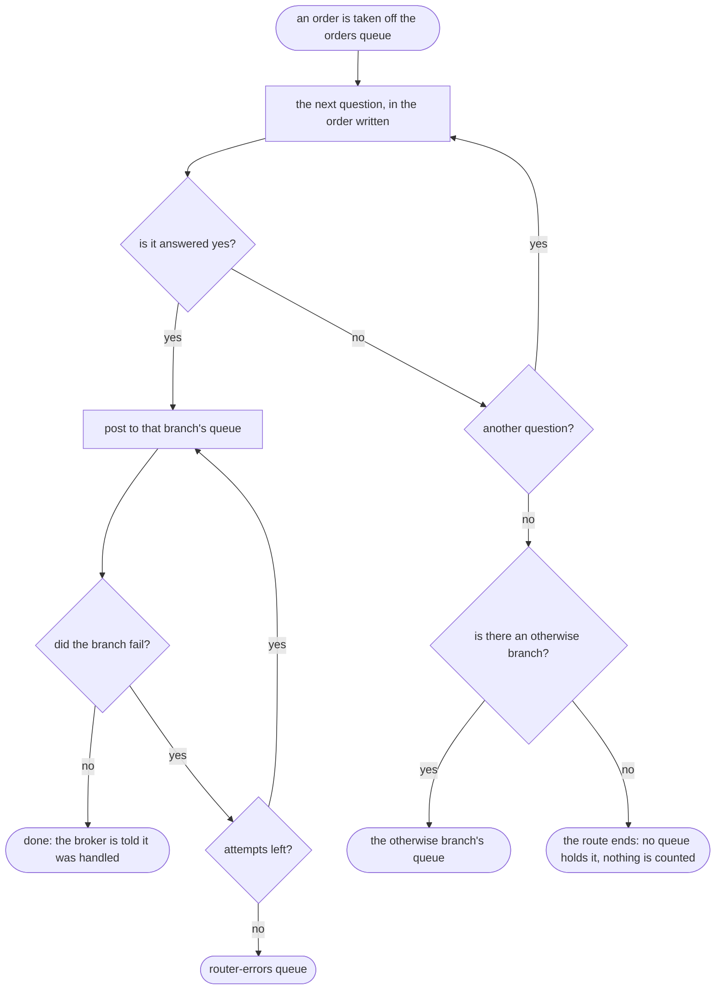

# Content-Based Router with Camel Pattern — Data Flow Diagram

What the route does with one order, including the two ways it can end badly.

Mermaid source

```mermaid
flowchart TD
    Order(["an order is taken off the orders queue"])
    Next["the next question, in the order written"]
    Match{"is it answered yes?"}
    Send["post to that branch's queue"]
    Fail{"did the branch fail?"}
    Retry{"attempts left?"}
    Err(["router-errors queue"])
    Done(["done: the broker is told it was handled"])
    More{"another question?"}
    Other{"is there an otherwise branch?"}
    Fall(["the otherwise branch's queue"])
    Gone(["the route ends: no queue holds it, nothing is counted"])
    Order --> Next --> Match
    Match -- yes --> Send --> Fail
    Fail -- no --> Done
    Fail -- yes --> Retry
    Retry -- yes --> Send
    Retry -- no --> Err
    Match -- no --> More
    More -- yes --> Next
    More -- no --> Other
    Other -- yes --> Fall
    Other -- no --> Gone
```

