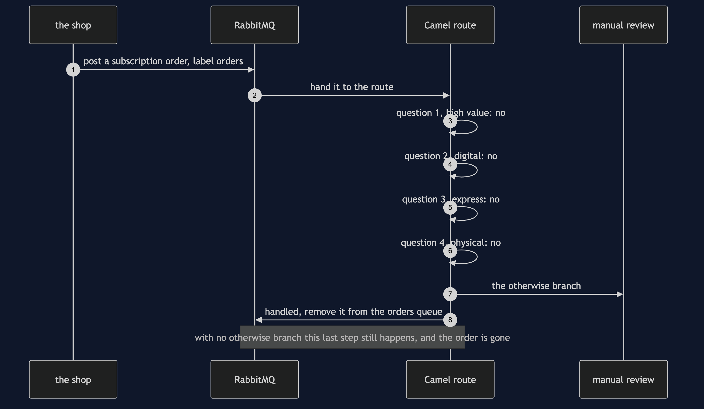

# Content-Based Router with Camel Pattern — Sequence Diagram

Written for a listener with the screen off.

Say it in words. The shop posts an order to the broker's shop exchange with the label orders, and the broker puts it on the orders queue. A Camel route is already reading that queue, so it takes the order off. The route asks its first question: is this order worth a thousand pounds or more? The order is a subscription worth nine pounds and ninety-nine pence, so the answer is no. It asks the second: is it digital? No. The third: was express delivery paid for? No. The fourth: is it a physical thing? No. Every question has been answered no, so the route takes its otherwise branch and posts the order to the manual review queue, where a person will find it. Only then does the route tell the broker that the original message was handled, and the broker removes it from the orders queue. Had there been no otherwise branch, the route would have told the broker exactly the same thing, and the order would now be on no queue at all.

The load-bearing sentence: **a message that no question claims is only kept if the route says where to keep it.**

For the other sequences — the order of the questions deciding the destination, the failing branch, and the question added without touching anybody else — see [`uml-diagram.md`](uml-diagram.md).
