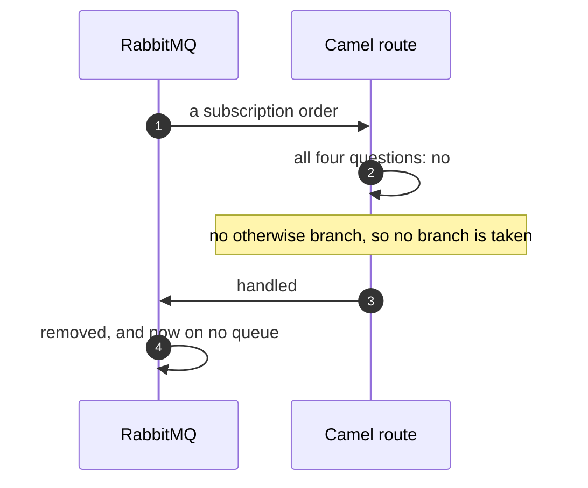
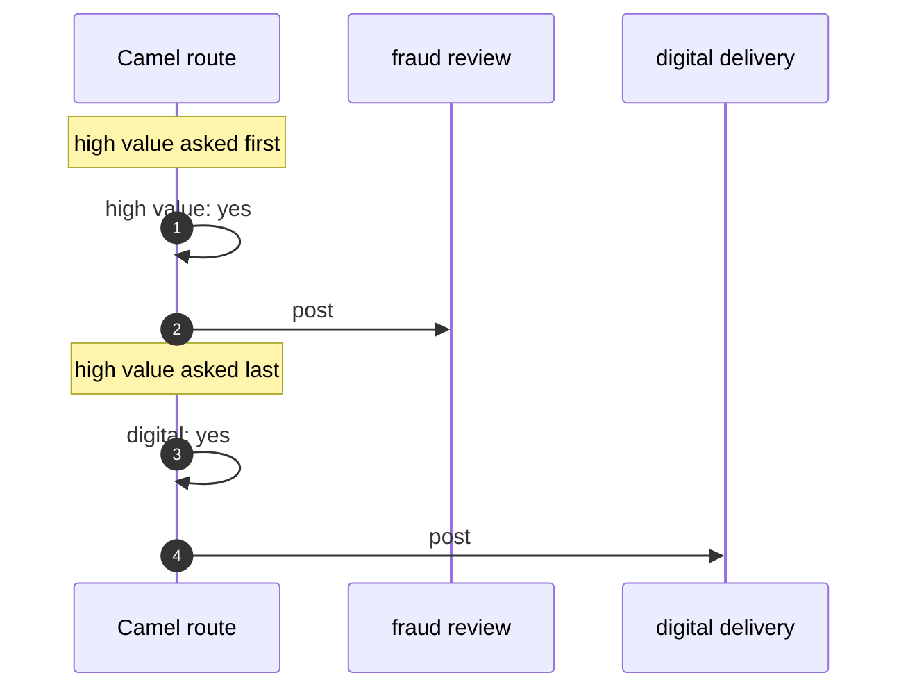
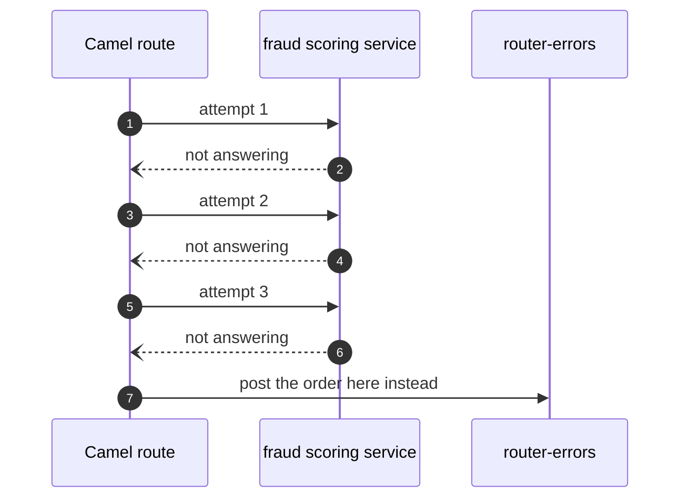
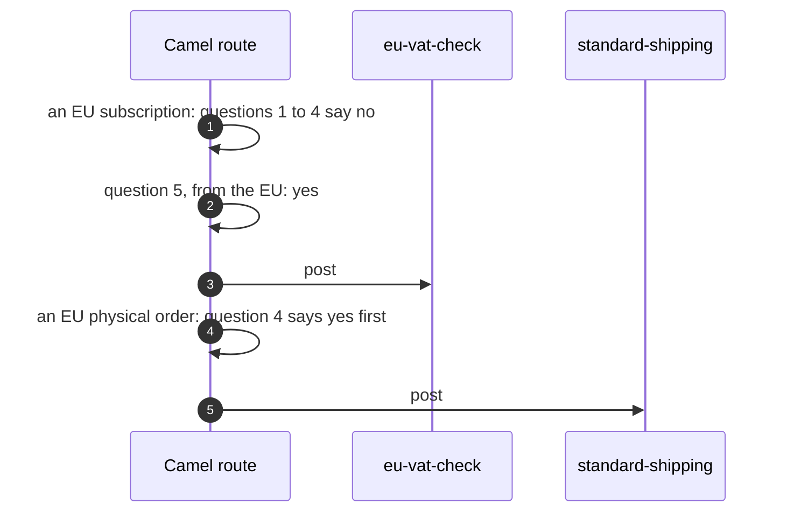

# Content-Based Router with Camel Pattern — UML Sequence Diagrams

Four sequences. The first is the one rendered above, because it is the failure this project exists to show.

## 1. A Message No Question Claims, With No Otherwise Branch

In words: the route asks all four of its questions about a subscription order and every one is answered no. There is no otherwise branch, so no branch is taken, the route ends, and the route tells the broker the message was handled. The broker removes it. No queue in the shop holds it, and nothing was counted.

Mermaid source

## 2. The Order Of The Questions Decides

In words: the same digital gift card, worth fifteen hundred pounds, goes through two routes. The first route asks the high value question first, so the gift card goes to fraud review. The second route asks it last, so the digital question is reached first and the gift card goes to digital delivery.

Mermaid source

## 3. A Branch That Cannot Finish

In words: a physical order worth two thousand five hundred pounds is claimed by the high value question, and the fraud branch calls a service that is not answering. Camel tries the branch, it fails, and Camel tries it again twice more. After the third failure it stops and posts the order to the errors queue, so the order is kept rather than lost.

Mermaid source

## 4. A Question Added, And Nobody Else Changes

In words: a fifth question is written into the route, asking whether the order is from inside the European Union, and it is asked after the other four. A subscription from the European Union used to fall through to manual review and now goes to the VAT check. A physical order from the European Union still goes to standard shipping, because the physical question is asked earlier. No sender and no receiving queue was touched.

Mermaid source

