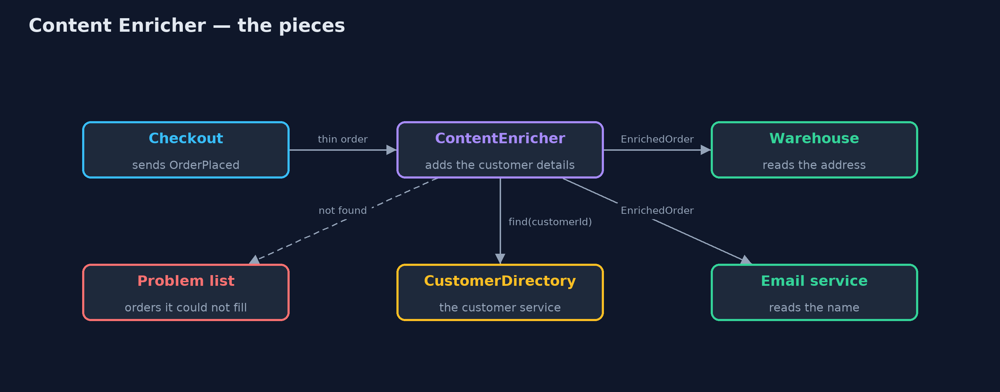

# Content Enricher Pattern

```
src/main/java/com/jk/explore/contentenricher/
├── ContentEnricher.java      The pattern: takes each thin order, adds the customer's details once, and passes the full message on
├── ContentEnricherDemo.java  The five acts: the thin message, every receiver looking it up, the enricher, a missing customer, and the bill
├── Customer.java             What the customer service knows about a customer: name, delivery address and loyalty tier
├── CustomerDirectory.java    The customer service, in memory: counts every lookup, and can be switched off to show an outage
├── EnrichedOrder.java        The same order with the customer's details added, so no receiver has to look them up
├── OrderPlaced.java          The thin message checkout sends: which order, which customer id, and the items
└── Receivers.java            The two services that receive orders: the warehouse packs them and the email service confirms them
```

**When a message is too thin for its receivers, add the missing details once, in the middle, instead of making every receiver look them up.**

Content Enricher is one of the Enterprise Integration Patterns, the catalogue of
messaging patterns by Gregor Hohpe and Bobby Woolf. A message arrives with only
part of what its receivers need, often just an identifier. The enricher sits
between the sender and the receivers. It looks the missing details up once,
adds them to the message, and passes the fuller message on.

The receivers then have everything in the message itself. They make no calls
of their own, and they keep working when the service that holds the details is
down.

## The idea in everyday terms

Think of a post office sorting room. A letter arrives addressed only to "the
Shah family, Mill Lane". A clerk looks up the house number and the postcode in
the directory, writes them on the envelope, and sends it on. The postman who
delivers it does not need the directory at all.

Without the clerk, every postman on every round would carry a directory and
look up every letter themselves.

## The scenario

When a customer pays, checkout sends an "order placed" message that holds the
order number, the items and a customer identifier, and nothing else. The
warehouse needs the delivery address. The email service needs the customer's
name. Each of them was calling the customer service for every order, and when
that service went down, parcels stopped being packed.

## Run

```bash
./gradlew run
```

The demo tells the story in 5 acts, each printing exact numbers that the tests check:

| Act | What it shows |
| --- | --- |
| 1. The thin message | Checkout sends ORD-1 with customer C-17 and a kettle: no name, no address, no loyalty tier. |
| 2. Every receiver looks it up | 3 orders and 2 receivers make 6 calls to the customer service; when it goes down, packing stops. |
| 3. The enricher | One enricher adds name, address and tier; with a cache, 3 orders need 2 calls; receivers work while the service is down. |
| 4. A customer who cannot be found | ORD-4 names customer C-99, who does not exist; it goes to the problem list instead of travelling on half-filled. |
| 5. The bill | Priya moves house after her order was enriched; the message still says 4 Mill Lane. Every message is bigger for every receiver. |

## Test

```bash
./gradlew test
```

11 tests in `ContentEnricherTest`, `DemoRunsTest`. Every number the demo prints is asserted, and nothing depends on the clock, so every run gives the same result.

## Technologies and versions

| Technology | Version | Used for |
| --- | --- | --- |
| Java | 21 | the code (toolchain set in `build.gradle`) |
| Gradle | 9.2.1 (wrapper) | build and run, nothing to install |
| JUnit | 5.10.2 | the tests |
| videokit | repository tool | the narrated video and animation: Piper `en_US-amy-medium`, speed 0.8, longer pauses (the approved `amy-slow` voice) |

## Learning Material

| Document | What it is for |
| --- | --- |
| [Problem statement](docs/problem-statement.md) | the situation and what the project must show |
| [Prerequisites](docs/prerequisites.md) | what you need to know first |
| [Content Enricher, explained](docs/content-enricher-pattern-explained.md) | the acts in prose |
| [Session guide](docs/session.md) | a one-hour lesson with exercises |
| [Animated walkthrough](docs/animation.html) | the acts step by step, narrated |
| [Spec](docs/spec.md) | what this project must be true of |

### The pattern in one picture

The enricher is the only part that talks to the customer service. The receivers read the message.



### Where each piece sits

Two records for the two messages, one class that turns the first into the second.


### How the data moves

The message starts with an identifier and leaves with the details the receivers need.


### Who calls whom, in order

One lookup, in the middle; the receivers only read.


### Video

`video/content-enricher-pattern-explained.mp4` (with `.m4a` audio and `.srt` subtitles) is built by `video/build_video.sh`. Rendered media is not committed.

## What it costs

- **Bigger messages.** Every receiver gets the added details, whether it needs them or not.
- **A copy, not the truth.** The details are taken at one moment. If the customer moves house a minute later, the message still carries the old address.
- **One more step that can fail.** The enricher depends on the customer service, so it needs a plan for customers it cannot find.
- **Personal data travels further.** Names and addresses now sit in every copy of the message, which matters for privacy rules.

## When this is too much

When only one receiver needs the extra details, let that receiver look them up.
And when the details change often and must be current, such as stock levels or
prices, a receiver should ask the owning service at the moment it acts,
instead of trusting a copy made earlier.

## Where you have already met this

- Apache Camel's `enrich` and `pollEnrich`, and Spring Integration's `<int:enricher>`.
- Kafka Streams joining a stream of orders with a table of customers.
- An API gateway adding a user's details to a request after checking their login token.
- Log shippers that add the host name and region to every log line.

## Where this sits

This project is in [messaging-integration-patterns](..), next to
[Content-Based Router](../content-based-router-pattern), which decides where a
message goes, and [Splitter and Aggregator](../splitter-aggregator-pattern),
which change how many messages there are. The enricher changes what one message
carries.
