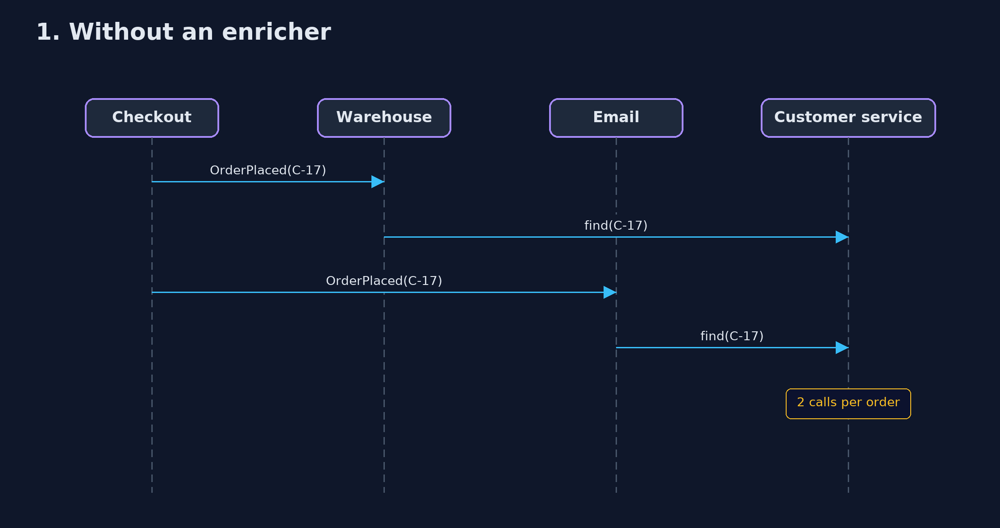
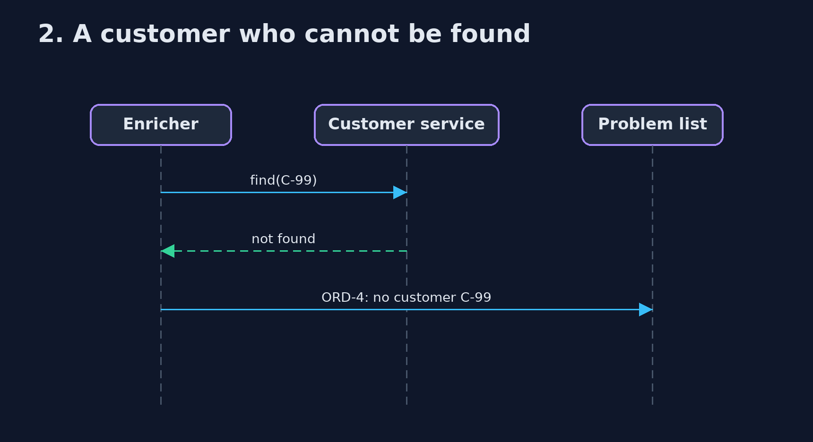

# Content Enricher Pattern — UML Sequence Diagrams

## 1. 1. Without an enricher

Every receiver asks, for every order.

## 2. 2. A customer who cannot be found

The order is parked with a reason instead of travelling on half-filled.

