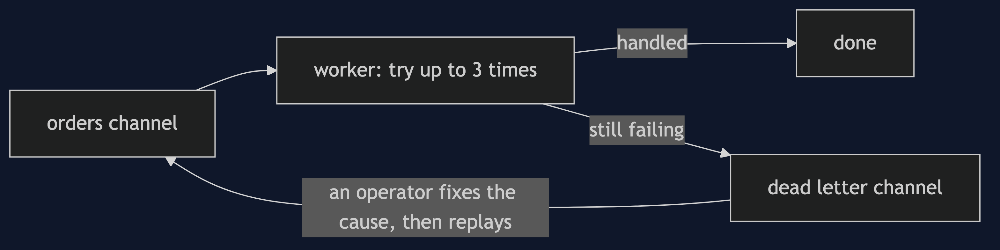
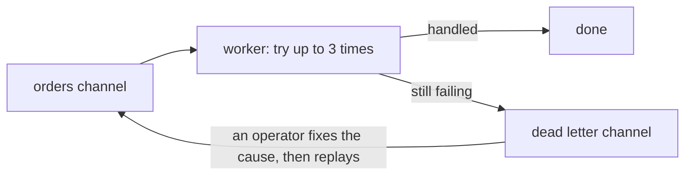

# Dead Letter Channel Pattern — Architecture Diagram

Good messages go through. Poison messages are moved aside.

Mermaid source

```mermaid
flowchart LR
    C["orders channel"] --> W["worker: try up to 3 times"]
    W -->|handled| H["done"]
    W -->|still failing| D["dead letter channel"]
    D -->|an operator fixes the cause, then replays| C
```

