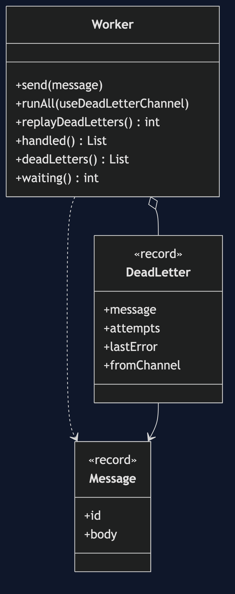
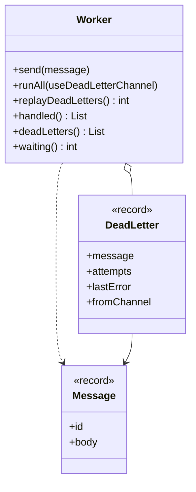

# Dead Letter Channel Pattern — Class Diagram

A worker retries a message, then moves it to the dead letters.

Mermaid source

```mermaid
classDiagram
    class Worker {
        +send(message)
        +runAll(useDeadLetterChannel)
        +replayDeadLetters() int
        +handled() List
        +deadLetters() List
        +waiting() int
    }
    class DeadLetter {
        <<record>>
        +message
        +attempts
        +lastError
        +fromChannel
    }
    class Message {
        <<record>>
        +id
        +body
    }
    Worker o-- DeadLetter
    Worker ..> Message
    DeadLetter --> Message
```

