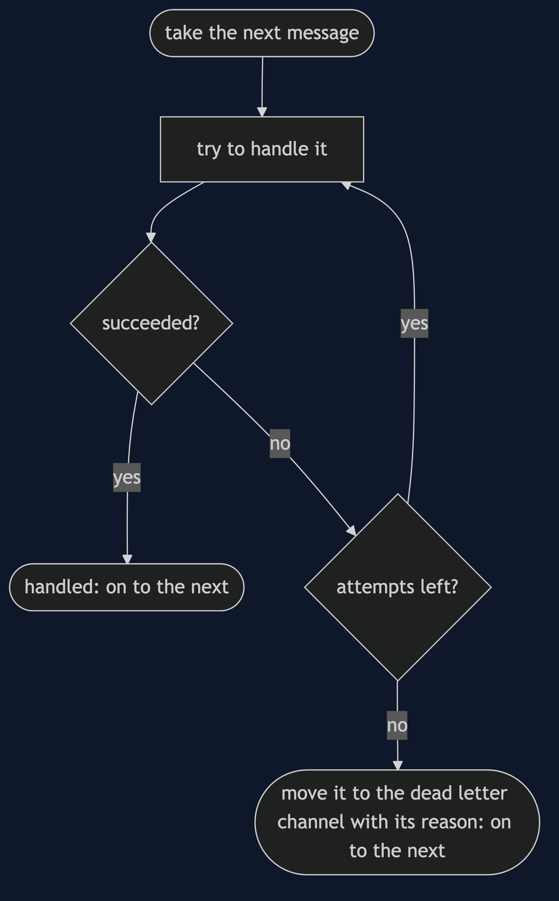
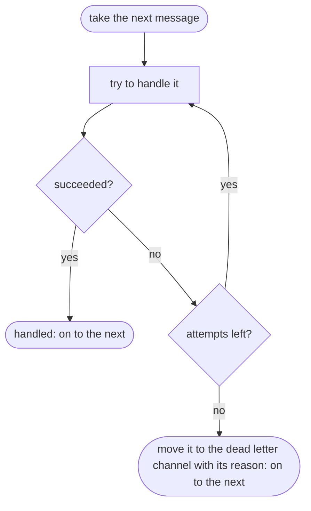

# Dead Letter Channel Pattern — Data Flow Diagram

What the worker does with a message.

Mermaid source

```mermaid
flowchart TD
    Take(["take the next message"])
    Try["try to handle it"]
    Ok{"succeeded?"}
    Done(["handled: on to the next"])
    Left{"attempts left?"}
    Dead(["move it to the dead letter channel with its reason: on to the next"])
    Take --> Try --> Ok
    Ok -- yes --> Done
    Ok -- no --> Left
    Left -- yes --> Try
    Left -- no --> Dead
```

