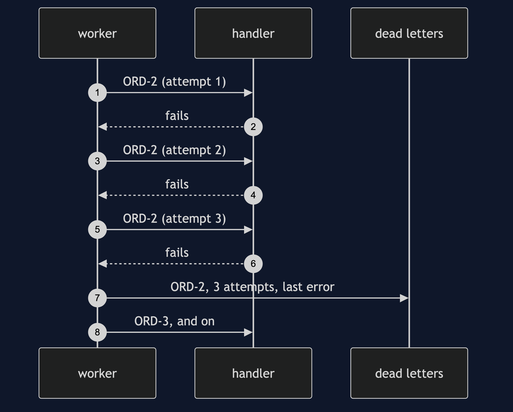
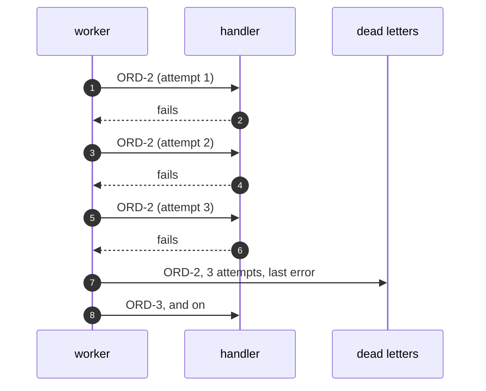

# Dead Letter Channel Pattern — Sequence Diagram

Written for a listener with the screen off.

Say it in words. The worker takes order two. It tries to read the body, and fails. It tries again, and fails. It tries a third time, and fails. The limit is three, so the worker moves order two to the dead letter channel, with the number of attempts and the last error. Then it takes order three, which is fine, and goes on.

Mermaid source

The load-bearing sentence: **the worker gives up on one message so that it does not give up on all of them.**
