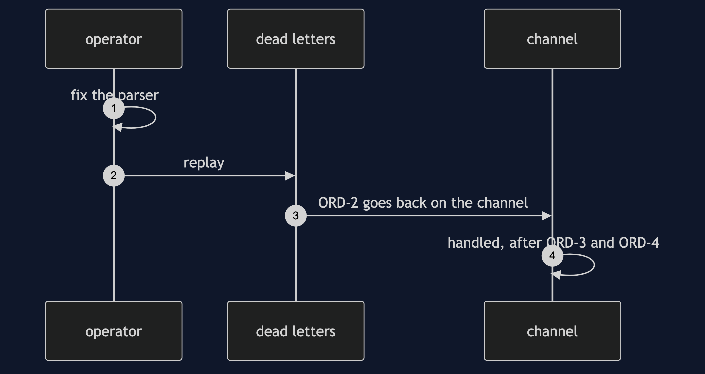
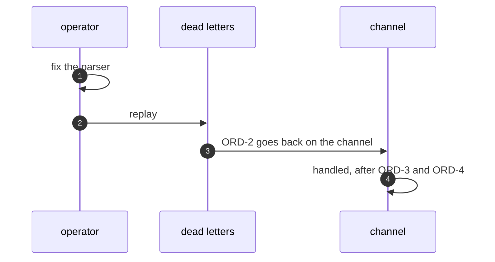

# Dead Letter Channel Pattern — UML Sequence Diagrams

Four sequences.

## 1. A Replay

Mermaid source

```mermaid
sequenceDiagram
    autonumber
    participant O as operator
    participant D as dead letters
    participant C as channel
    O->>O: fix the parser
    O->>D: replay
    D->>C: ORD-2 goes back on the channel
    C->>C: handled, after ORD-3 and ORD-4
```

