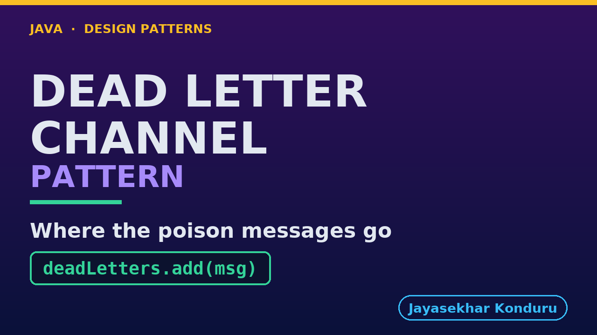

# YouTube — Dead Letter Channel Pattern

Everything needed to publish `video/dead-letter-channel-pattern-explained.mp4`. Copy the fields straight out of this file.

Chapter timings are generated from the video's `.srt`. Re-run `python3 docs/make_youtube_docs.py dead-letter-channel` after any change to the narration, or they will be wrong.

## Title

```
Dead Letter Channel
```

19 characters — under the 60 YouTube shows before truncating in search results.

## Description

The first two lines are what a viewer sees above the fold, so they carry the hook rather than the boilerplate.

```
Dead Letter Channel pattern in Java, explained with an online store order that arrives garbled and can never be read. A dead letter channel is where a message goes after a fixed number of failed tries, so it stops blocking the messages behind it and someone can look at it later, like the post office's undeliverable mail room. We watch one bad message block everything, then move it aside after three tries with its reason. We tell a slow moment apart from a dead letter, replay a message after a fix, and face the real cost: nobody is looking.

CHAPTERS
00:00 Introduction
00:56 The Scenario
01:12 A Message That Can Never Succeed
01:32 The Pattern
01:46 A Dead Letter Channel
02:02 It Says Why
02:22 A Slow Day Is Not A Dead Letter
02:45 Fix It, And Replay
03:03 The Bill: Nobody Is Looking
03:35 How To Recognise It
03:56 The Verdict
04:23 What Is Real Here
04:36 When This Is Too Much
04:51 Thanks for Watching

SOURCE CODE, WRITTEN NOTES AND AN INTERACTIVE ANIMATION
https://github.com/jk-boot-up/java-design-patterns/tree/main/gradle-java/messaging-integration-patterns/dead-letter-channel-pattern

WHAT YOU NEED FIRST
Java 21 and a working knowledge of classes and interfaces. No prior design-pattern knowledge is assumed. The full prerequisites are in docs/prerequisites.md in the repository.
```

## Chapters

YouTube renders these as chapters only if there are at least three and the first is at `00:00`.

```
00:00 Introduction
00:56 The Scenario
01:12 A Message That Can Never Succeed
01:32 The Pattern
01:46 A Dead Letter Channel
02:02 It Says Why
02:22 A Slow Day Is Not A Dead Letter
02:45 Fix It, And Replay
03:03 The Bill: Nobody Is Looking
03:35 How To Recognise It
03:56 The Verdict
04:23 What Is Real Here
04:36 When This Is Too Much
04:51 Thanks for Watching
```

## Tags

```
dead letter queue, dead letter channel, messaging, design patterns, java design patterns, gang of four, java 21, software design, clean code, object oriented design, java tutorial, ecommerce, programming tutorial
```

212 characters, under YouTube's 500 limit.

## Thumbnail



**Upload `docs/thumbnail.png`** — 1280×720, the size YouTube recommends, generated by `docs/make_thumbnails.py`. It is deliberately not the same image as the video's opening frame: a thumbnail is judged at about 360 pixels wide in a search result, so this one carries only the pattern name, one line of promise and one short piece of code, each set large enough to survive the shrink.

`video/poster.png` is the 1920×1080 opening frame, produced by the video build. It stays in the repository as the title card; it is not what gets uploaded.

YouTube will not pick the thumbnail up on its own — upload it under **Details → Thumbnail → Upload file**. A custom thumbnail requires a verified channel.

## Upload checklist

- [ ] Upload `video/dead-letter-channel-pattern-explained.mp4` (1080p, H.264, 30 fps, AAC 48 kHz — already YouTube's recommended settings, no re-encode needed)
- [ ] Set the video language to **English** first, or the subtitle option may not appear
- [ ] Add subtitles: *Video elements → Add subtitles → Upload file → With timing* → `video/dead-letter-channel-pattern-explained.srt`
- [ ] Upload `docs/thumbnail.png` as the thumbnail — do not let YouTube auto-pick a frame
- [ ] Paste the title, description and tags from above
- [ ] Add to the **Java Design Patterns** playlist, in learning order
- [ ] Wait for 1080p processing before sharing the link — code slides are unreadable at 360p

## Cards and end screen

End screen links to whichever pattern video goes up next — set it at upload time rather than assuming an order.

Add a card partway through pointing at the playlist, so a viewer who arrives at this pattern from search can find the rest of the series.

## Runtime

Approximately 05:27, narrated at 145 words per minute.
