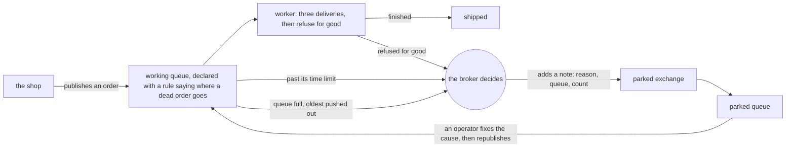

# Dead Letter Channel with RabbitMQ Pattern — Architecture Diagram

Good orders are shipped. Dead orders are moved by the broker, not by the application.

Mermaid source

```mermaid
flowchart LR
    S["the shop"] -->|publishes an order| Q["working queue, declared with a rule saying where a dead order goes"]
    Q --> W["worker: three deliveries, then refuse for good"]
    W -->|finished| D["shipped"]
    W -->|refused for good| B(("the broker decides"))
    Q -->|past its time limit| B
    Q -->|queue full, oldest pushed out| B
    B -->|adds a note: reason, queue, count| X["parked exchange"]
    X --> P["parked queue"]
    P -->|an operator fixes the cause, then republishes| Q
```

