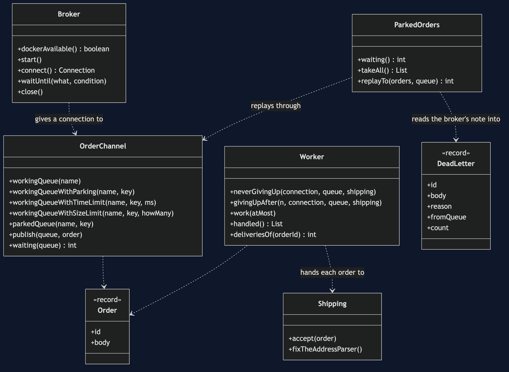
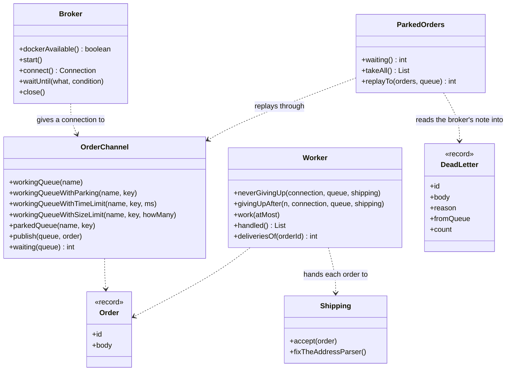

# Dead Letter Channel with RabbitMQ Pattern — Class Diagram

The shop declares the queues and their rules. The worker finishes an order or refuses it. The broker does the rest.

Mermaid source

```mermaid
classDiagram
    class Broker {
        +dockerAvailable() boolean
        +start()
        +connect() Connection
        +waitUntil(what, condition)
        +close()
    }
    class OrderChannel {
        +workingQueue(name)
        +workingQueueWithParking(name, key)
        +workingQueueWithTimeLimit(name, key, ms)
        +workingQueueWithSizeLimit(name, key, howMany)
        +parkedQueue(name, key)
        +publish(queue, order)
        +waiting(queue) int
    }
    class Worker {
        +neverGivingUp(connection, queue, shipping)
        +givingUpAfter(n, connection, queue, shipping)
        +work(atMost)
        +handled() List
        +deliveriesOf(orderId) int
    }
    class ParkedOrders {
        +waiting() int
        +takeAll() List
        +replayTo(orders, queue) int
    }
    class Shipping {
        +accept(order)
        +fixTheAddressParser()
    }
    class Order {
        <<record>>
        +id
        +body
    }
    class DeadLetter {
        <<record>>
        +id
        +body
        +reason
        +fromQueue
        +count
    }
    Broker ..> OrderChannel : gives a connection to
    OrderChannel ..> Order
    Worker ..> Shipping : hands each order to
    Worker ..> Order
    ParkedOrders ..> DeadLetter : reads the broker's note into
    ParkedOrders ..> OrderChannel : replays through
```

