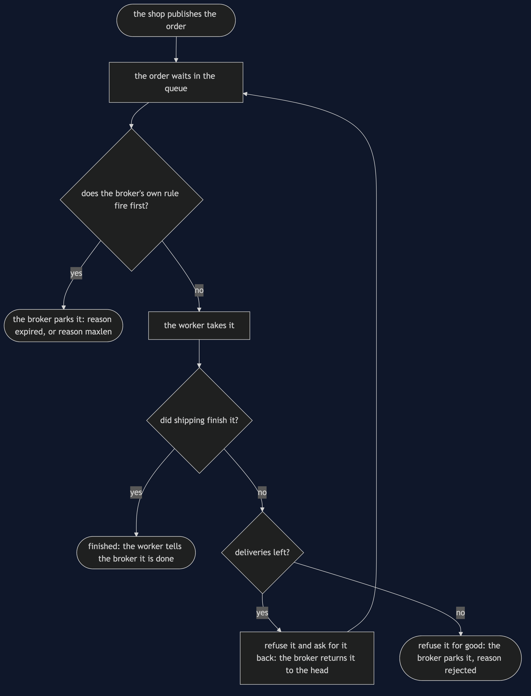
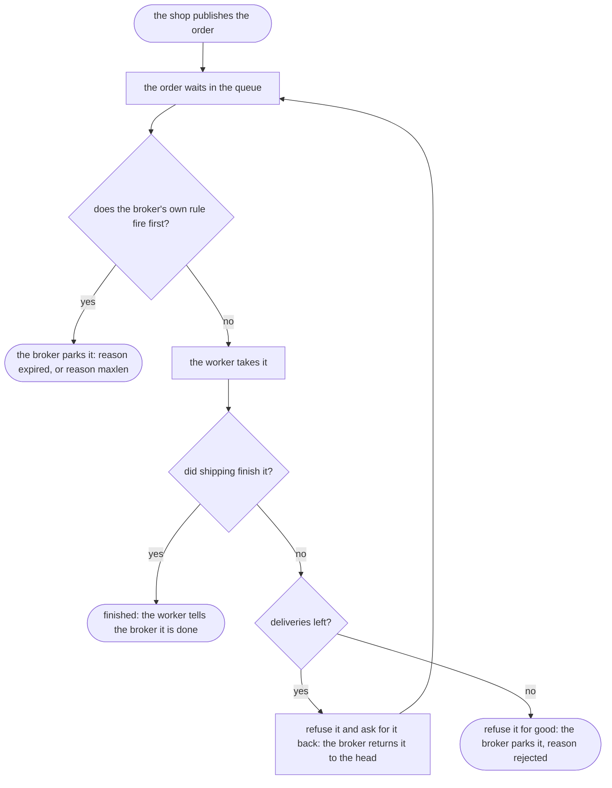

# Dead Letter Channel with RabbitMQ Pattern — Data Flow Diagram

What happens to one order, and which side makes each decision.

Mermaid source

```mermaid
flowchart TD
    Pub(["the shop publishes the order"])
    Wait["the order waits in the queue"]
    Rules{"does the broker's own rule fire first?"}
    Broker(["the broker parks it: reason expired, or reason maxlen"])
    Take["the worker takes it"]
    Ok{"did shipping finish it?"}
    Done(["finished: the worker tells the broker it is done"])
    Left{"deliveries left?"}
    Back["refuse it and ask for it back: the broker returns it to the head"]
    Refuse(["refuse it for good: the broker parks it, reason rejected"])
    Pub --> Wait --> Rules
    Rules -- yes --> Broker
    Rules -- no --> Take --> Ok
    Ok -- yes --> Done
    Ok -- no --> Left
    Left -- yes --> Back --> Wait
    Left -- no --> Refuse
```

