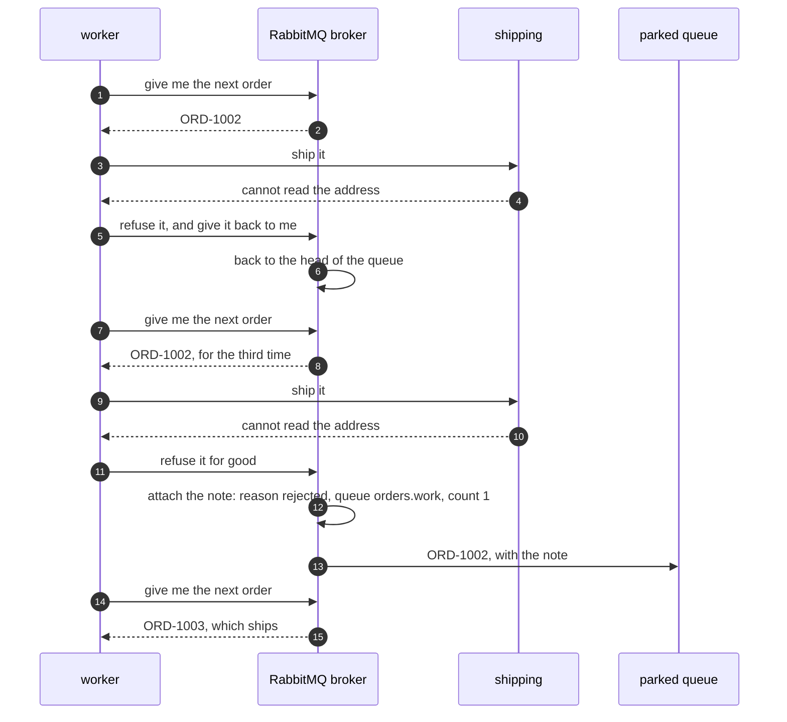

# Dead Letter Channel with RabbitMQ Pattern — Sequence Diagram

Written for a listener with the screen off.

Say it in words. The shop publishes four orders onto a queue, and that queue was declared with a rule on it: if an order dies here, send it to the parked exchange. The worker asks the broker for the next order and gets the second one, whose address nothing can read. Shipping fails. The worker refuses the order and asks for it back, and the broker puts it at the head of the line. That happens twice more. On the third failure the worker refuses it for good and does not ask for it back. Now the worker does nothing else — it is the broker that acts. The broker takes the order out of the queue, attaches a note saying the queue it died in, the number of deaths, and the reason, which is the word rejected, and hands it to the parked exchange, which puts it on the parked queue. The worker asks for the next order and gets the third one, which ships.

Mermaid source

The load-bearing sentence: **the worker only refuses the order; the broker is what moves it, and the broker is what writes down why.**

The rejected designs and the other failure modes are in [`uml-diagram.md`](uml-diagram.md).
