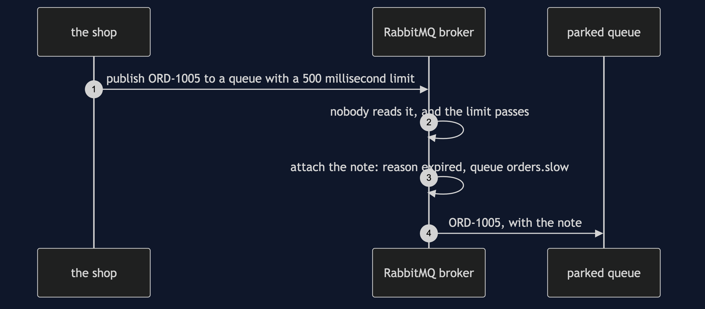
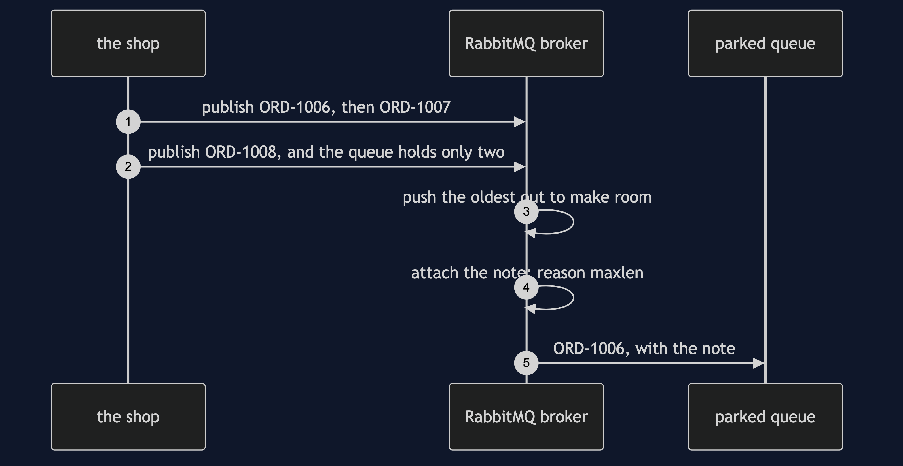
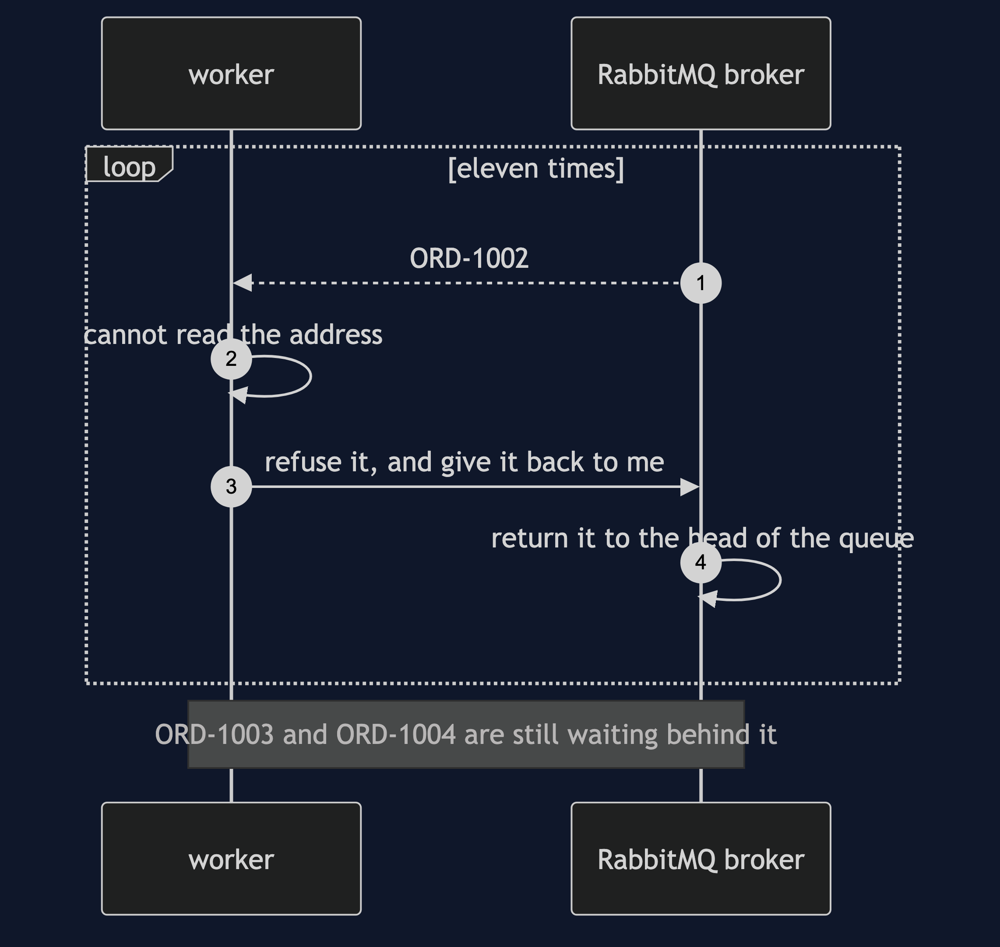
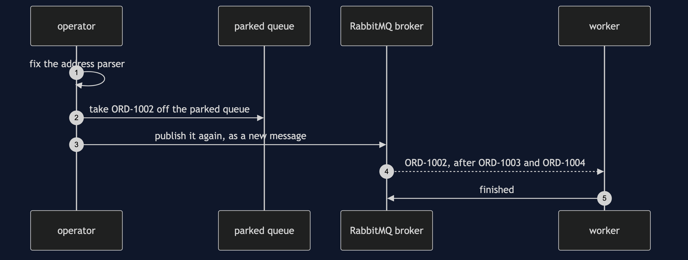

# Dead Letter Channel with RabbitMQ Pattern — UML Sequence Diagrams

Four sequences. The first is the one the README shows, because it is the one that is new: a death nobody chose.

## 1. An Order That Runs Out Of Time

Nobody refuses this order. Nobody even reads it. The queue was declared with a time limit, and when the limit passes the broker parks the order itself, with the reason expired.

## 2. A Queue That Is Full

The queue was declared to hold two orders. A third arrives. To make room the broker pushes the oldest out, and parks it with the reason maxlen.

## 3. Asking For It Back, For Ever

The mistake the pattern exists to prevent. The worker refuses the order and asks for it back every time, so the broker keeps returning it to the head of the queue, and nothing behind it moves.

## 4. A Replay

An operator fixes the cause and publishes the parked order back onto the working queue. It goes to the back of the line, and the broker's note does not travel with it.

