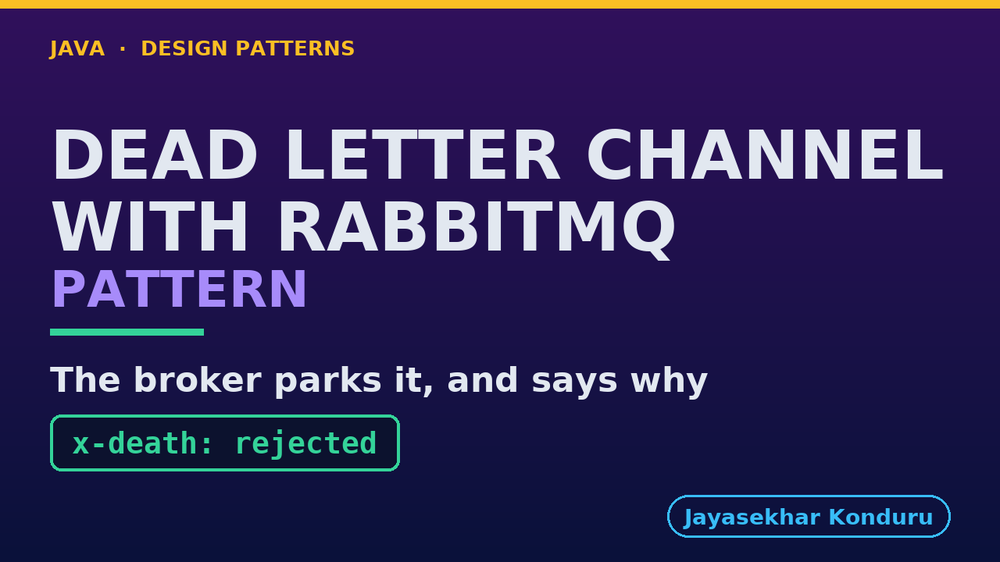

# YouTube — Dead Letter Channel With Rabbitmq Pattern

Everything needed to publish `video/dead-letter-channel-with-rabbitmq-pattern-explained.mp4`. Copy the fields straight out of this file.

Chapter timings are generated from the video's `.srt`. Re-run `python3 docs/make_youtube_docs.py dead-letter-channel-with-rabbitmq` after any change to the narration, or they will be wrong.

## Title

```
Dead Letter Channel with RabbitMQ
```

33 characters — under the 60 YouTube shows before truncating in search results.

## Description

The first two lines are what a viewer sees above the fold, so they carry the hook rather than the boilerplate.

```
Learn the Dead Letter Channel pattern in Java with RabbitMQ, using an online store queue of orders where one order's address can never be read. A dead letter channel takes a message that can never be handled off the belt and shelves it with a note, so the belt keeps moving and a person can look later. What is new with a real broker is who decides: the application writes a rule on the queue, and RabbitMQ takes the message off and writes down its own reason. We hear deaths nobody chose, fix and put a message back, and learn the three reasons a message dies. The bill is the same: someone has to look.

CHAPTERS
00:00 Introduction
00:56 The Partner Video
01:23 Three Words First
01:56 An Order That Can Never Succeed
02:24 A Rule Written On The Queue
03:02 The Broker Writes Down Why
03:26 Deaths Nobody Chose
04:00 Fix It, And Put It Back
04:32 The Bill: Nobody Is Looking
05:09 The Three Reasons
05:34 The Verdict
06:06 How To Recognise It
06:32 What Was Used
06:50 What Is Real Here
07:18 When This Is Too Much
07:34 Thanks for Watching

SOURCE CODE, WRITTEN NOTES AND AN INTERACTIVE ANIMATION
https://github.com/jk-boot-up/java-design-patterns/tree/main/gradle-java/messaging-integration-patterns/dead-letter-channel-with-rabbitmq-pattern

WHAT YOU NEED FIRST
Java 21 and a working knowledge of classes and interfaces. No prior design-pattern knowledge is assumed. The full prerequisites are in docs/prerequisites.md in the repository.
```

## Chapters

YouTube renders these as chapters only if there are at least three and the first is at `00:00`.

```
00:00 Introduction
00:56 The Partner Video
01:23 Three Words First
01:56 An Order That Can Never Succeed
02:24 A Rule Written On The Queue
03:02 The Broker Writes Down Why
03:26 Deaths Nobody Chose
04:00 Fix It, And Put It Back
04:32 The Bill: Nobody Is Looking
05:09 The Three Reasons
05:34 The Verdict
06:06 How To Recognise It
06:32 What Was Used
06:50 What Is Real Here
07:18 When This Is Too Much
07:34 Thanks for Watching
```

## Tags

```
dead letter channel, rabbitmq, dead letter queue, docker, design patterns, java design patterns, gang of four, java 21, software design, clean code, object oriented design, java tutorial, ecommerce, programming tutorial
```

219 characters, under YouTube's 500 limit.

## Thumbnail



**Upload `docs/thumbnail.png`** — 1280×720, the size YouTube recommends, generated by `docs/make_thumbnails.py`. It is deliberately not the same image as the video's opening frame: a thumbnail is judged at about 360 pixels wide in a search result, so this one carries only the pattern name, one line of promise and one short piece of code, each set large enough to survive the shrink.

`video/poster.png` is the 1920×1080 opening frame, produced by the video build. It stays in the repository as the title card; it is not what gets uploaded.

YouTube will not pick the thumbnail up on its own — upload it under **Details → Thumbnail → Upload file**. A custom thumbnail requires a verified channel.

## Upload checklist

- [ ] Upload `video/dead-letter-channel-with-rabbitmq-pattern-explained.mp4` (1080p, H.264, 30 fps, AAC 48 kHz — already YouTube's recommended settings, no re-encode needed)
- [ ] Set the video language to **English** first, or the subtitle option may not appear
- [ ] Add subtitles: *Video elements → Add subtitles → Upload file → With timing* → `video/dead-letter-channel-with-rabbitmq-pattern-explained.srt`
- [ ] Upload `docs/thumbnail.png` as the thumbnail — do not let YouTube auto-pick a frame
- [ ] Paste the title, description and tags from above
- [ ] Add to the **Java Design Patterns** playlist, in learning order
- [ ] Wait for 1080p processing before sharing the link — code slides are unreadable at 360p

## Cards and end screen

End screen links to whichever pattern video goes up next — set it at upload time rather than assuming an order.

Add a card partway through pointing at the playlist, so a viewer who arrives at this pattern from search can find the rest of the series.

## Runtime

Approximately 08:14, narrated at 145 words per minute.
