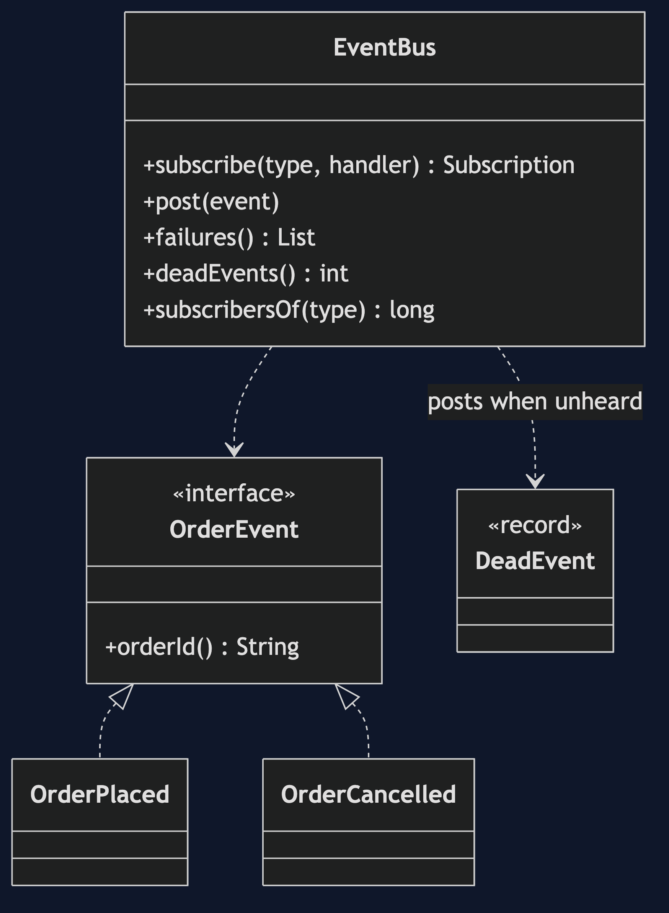
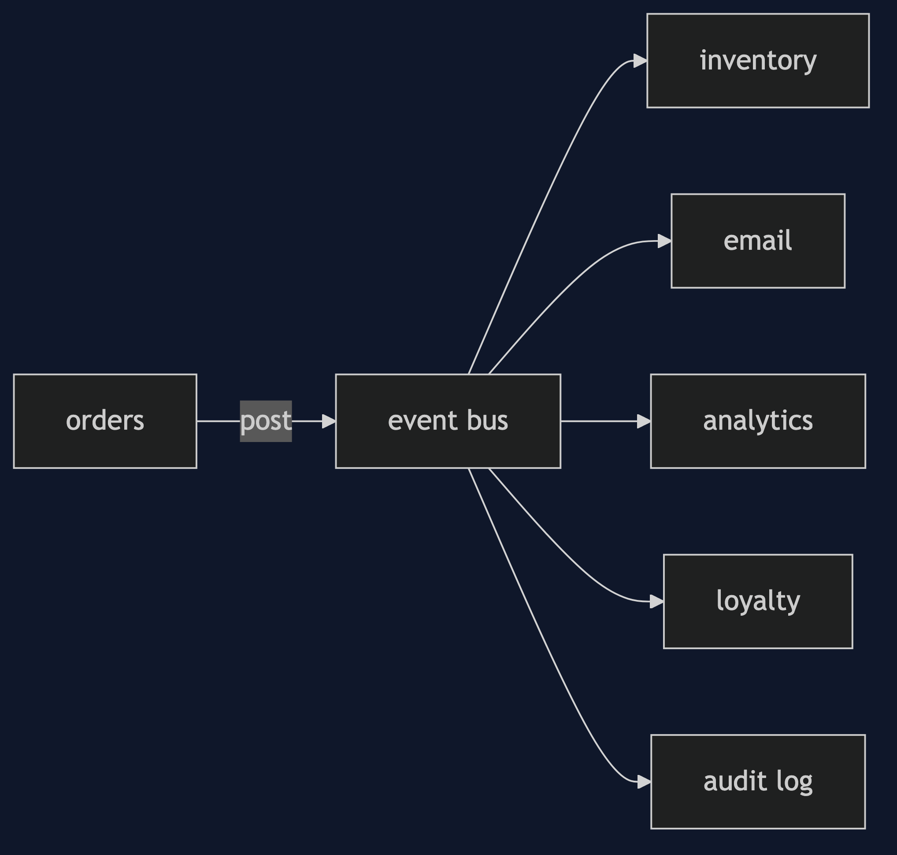
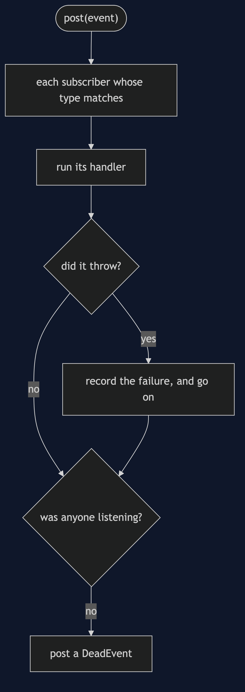
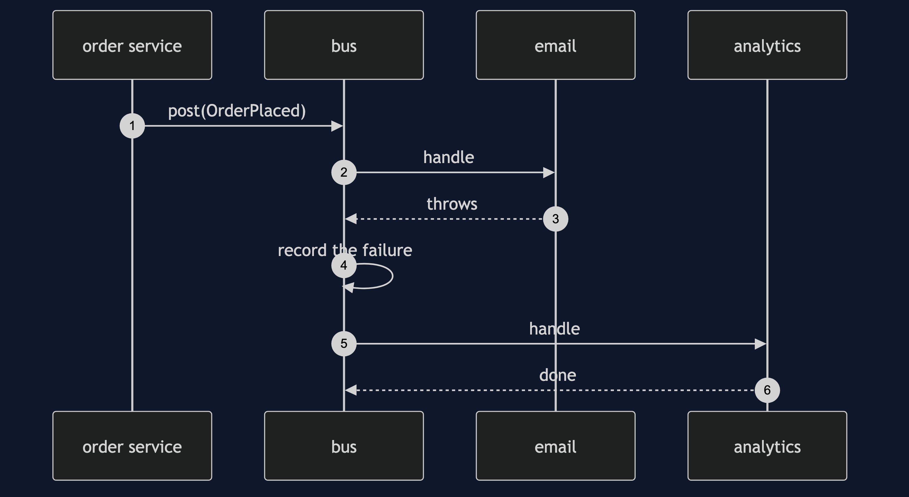
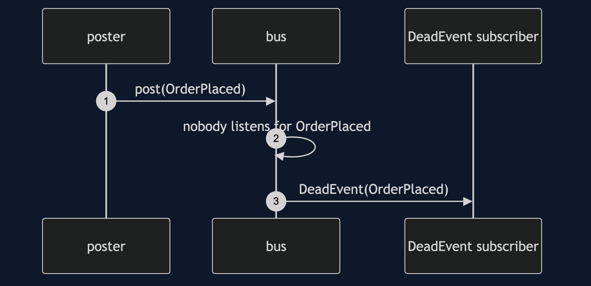

# Event Bus Pattern

```
src/main/java/com/jk/explore/eventbus/
├── EventBusDemo.java                the six acts
├── EventBus.java                    subscribe by type, post, dead events, failure isolation
├── OrderEvent.java  OrderPlaced.java  OrderCancelled.java  DeadEvent.java
```

**An event bus is one meeting place: post to it, subscribe to it, and never hold a reference to the other side.**

This is the fifth project in [messaging-integration-patterns](..). It is [Publisher-Subscriber](../../micro-services-design-patterns/publisher-subscriber-pattern) inside one program, and the in-process version of the [Message Channel](../message-channel-pattern) idea.

## Run

```bash
./gradlew run
```

Six acts. Every number quoted below comes from this program's own output.

```
ONE. Everyone knows everyone.
  5 components that each tell each other about orders: 20 references between them.
  add a sixth and it needs 10 more.
TWO. Everyone knows the bus.
  [inventory saw ORD-1, email saw ORD-1, analytics saw ORD-1].
  5 components, each with 1 reference to the bus: 5 references, not 20. the poster has no reference to any subscriber.
THREE. By type.
  a subscriber for OrderPlaced heard: [ORD-1].
  a subscriber for every OrderEvent heard: [OrderPlaced ORD-1, OrderCancelled ORD-1].
FOUR. One failing subscriber.
  email failed, analytics still heard it: [analytics counted ORD-1]. recorded: [OrderPlaced: mail server timed out].
  the poster did not see the failure. it posted, and carried on.
FIVE. An event nobody hears.
  no subscriber yet. dead events counted: 1, and nothing complained.
  with a subscriber for DeadEvent: [OrderPlaced[orderId=ORD-2, pence=100]].
  a typo in an event type, or a forgotten subscription, is a silent loss unless something listens for dead events.
SIX. The bill.
  who reacts to an OrderPlaced? nothing in the code that posts it says. the bus can be asked: 2 subscribers.
  1000 short-lived components subscribe and are then thrown away without unsubscribing: 1002 subscribers still held.
  the same, each cancelling its subscription: 0 held.
  and delivery is a plain method call in one process: a slow subscriber holds up the poster.
```

## Test

```bash
./gradlew test
```

2 test classes, 9 test methods, offline, with nothing installed and no framework.

## Technologies and versions

| What | Version | Why it is here |
| --- | --- | --- |
| Java | 21 | The repository standard, via the Gradle toolchain block |
| Gradle | 9.2.1 | The wrapper in this directory; no separate install needed |
| JUnit 5 | 5.10.2 | Test runner |

No framework. A hand-built project stays plain Java so the mechanism is the whole lesson.

## Learning Material

| Document | What it covers |
| --- | --- |
| [`docs/problem-statement.md`](docs/problem-statement.md) | The scenario, and the problem |
| [`docs/event-bus-pattern-explained.md`](docs/event-bus-pattern-explained.md) | The pattern, and six acts |
| [`docs/class-diagram.md`](docs/class-diagram.md) | The types |
| [`docs/architecture-diagram.md`](docs/architecture-diagram.md) | The parts and how they connect |
| [`docs/data-flow-diagram.md`](docs/data-flow-diagram.md) | What happens to one request |
| [`docs/sequence-diagram.md`](docs/sequence-diagram.md) | Written for a listener with the screen off |
| [`docs/uml-diagram.md`](docs/uml-diagram.md) | Four sequences |
| [`docs/animation.html`](docs/animation.html) | The six acts in a browser |
| [`docs/prerequisites.md`](docs/prerequisites.md) | What you need to know |
| [`docs/session.md`](docs/session.md) | A one-hour taught session |
| [`docs/spec.md`](docs/spec.md) | The generated specification |
| [`docs/youtube.md`](docs/youtube.md) | Title, description and chapters |

### The pattern in one picture



### Where each piece sits



### How one request moves



### Who calls whom, in order



### All four sequences




### Video

Built from [`video/scenes.py`](video/scenes.py) by
[`video/build_video.sh`](video/build_video.sh). The rendered file is not
committed; see the repository README for why.

## Where you have already met this

Guava's `EventBus`, Spring's application events, GreenRobot's EventBus, and every UI toolkit's event system.

## When this is too much

For two components that always talk, a direct call is clearer. A bus is for many-to-many, and its cost is a flow you cannot see by reading one class.

## Where this sits

This project is in [`messaging-integration-patterns`](..), and is meant to be read with its neighbours there.
