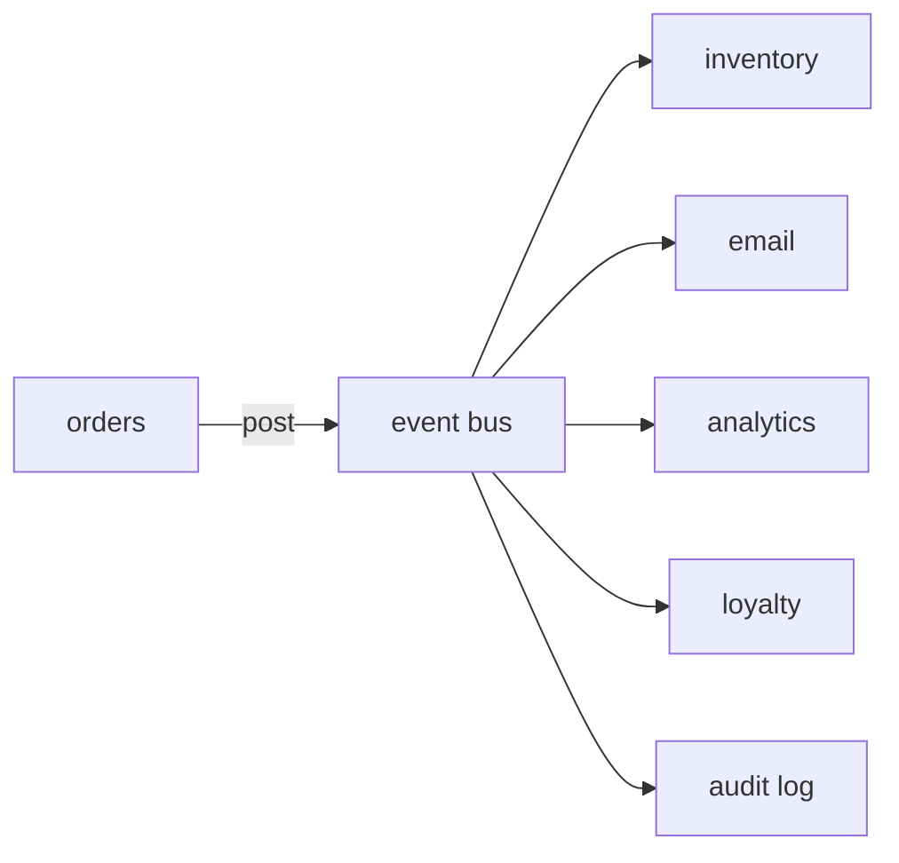

# Event Bus Pattern — Architecture Diagram

Every component talks to the bus, and to no other component.

Mermaid source

```mermaid
flowchart LR
    O["orders"] -->|post| B["event bus"]
    B --> I["inventory"]
    B --> E["email"]
    B --> A["analytics"]
    B --> L["loyalty"]
    B --> U["audit log"]
```

