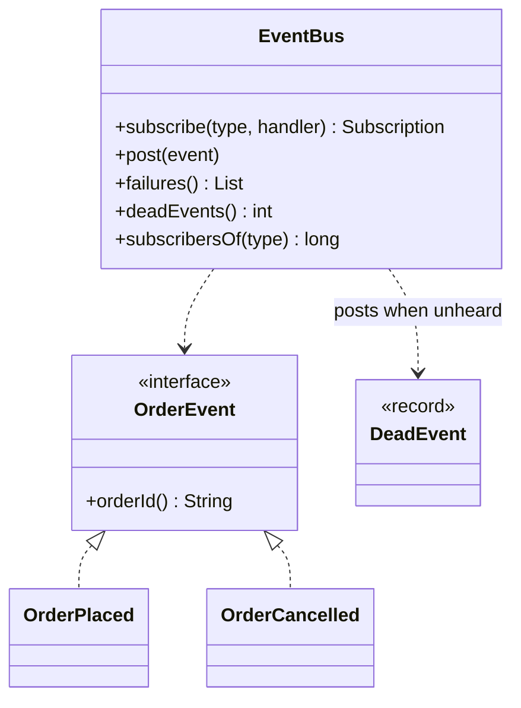

# Event Bus Pattern — Class Diagram

Components subscribe to a type and post events. They hold only the bus.

Mermaid source

```mermaid
classDiagram
    class EventBus {
        +subscribe(type, handler) Subscription
        +post(event)
        +failures() List
        +deadEvents() int
        +subscribersOf(type) long
    }
    class OrderEvent {
        <<interface>>
        +orderId() String
    }
    class OrderPlaced
    class OrderCancelled
    class DeadEvent {
        <<record>>
    }
    OrderEvent <|.. OrderPlaced
    OrderEvent <|.. OrderCancelled
    EventBus ..> OrderEvent
    EventBus ..> DeadEvent : posts when unheard
```

