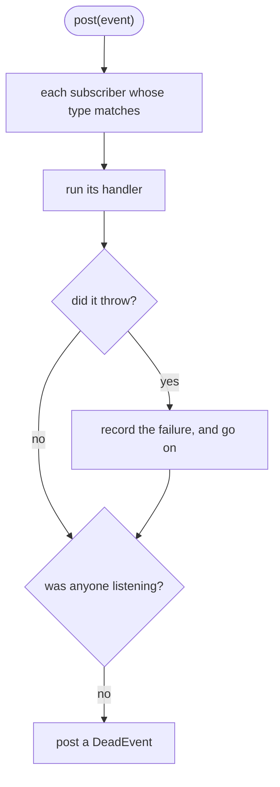

# Event Bus Pattern — Data Flow Diagram

What the bus does with a posted event.

Mermaid source

```mermaid
flowchart TD
    Post(["post(event)"])
    Each["each subscriber whose type matches"]
    Run["run its handler"]
    Fail{"did it throw?"}
    Rec["record the failure, and go on"]
    Any{"was anyone listening?"}
    Dead["post a DeadEvent"]
    Post --> Each --> Run --> Fail
    Fail -- yes --> Rec
    Fail -- no --> Any
    Rec --> Any
    Any -- no --> Dead
```

