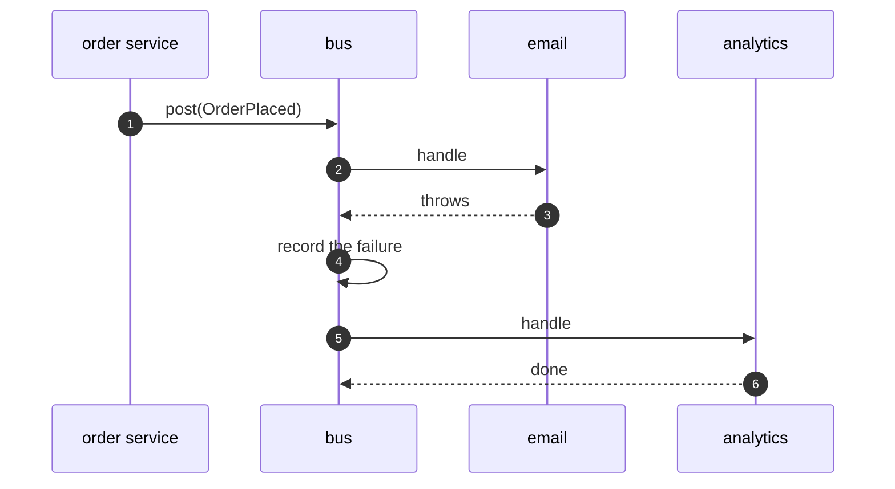

# Event Bus Pattern — Sequence Diagram

Written for a listener with the screen off.

Say it in words. The order service posts an order placed event to the bus. The bus looks for subscribers whose type matches. Email is one, and it throws, so the bus records the failure and goes on. Analytics is another, and it handles the event. The order service is told nothing, and never knew about either.

Mermaid source

The load-bearing sentence: **the poster never knows who listened, or who failed.**
