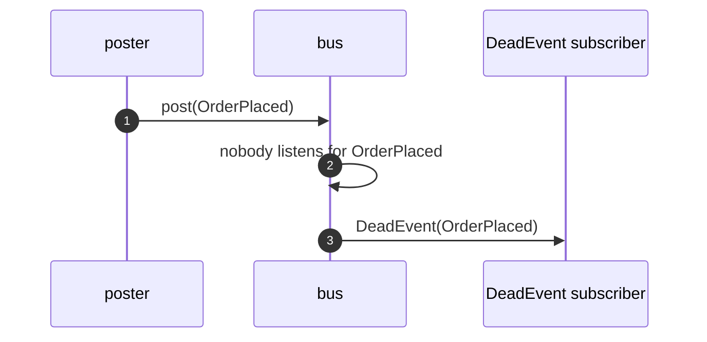

# Event Bus Pattern — UML Sequence Diagrams

Four sequences.

## 1. A Dead Event

Mermaid source

```mermaid
sequenceDiagram
    autonumber
    participant O as poster
    participant B as bus
    participant D as DeadEvent subscriber
    O->>B: post(OrderPlaced)
    B->>B: nobody listens for OrderPlaced
    B->>D: DeadEvent(OrderPlaced)
```

